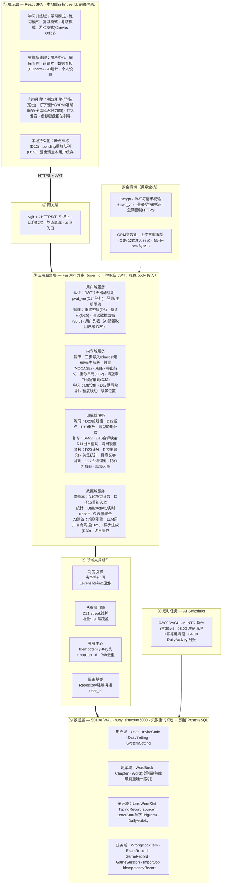
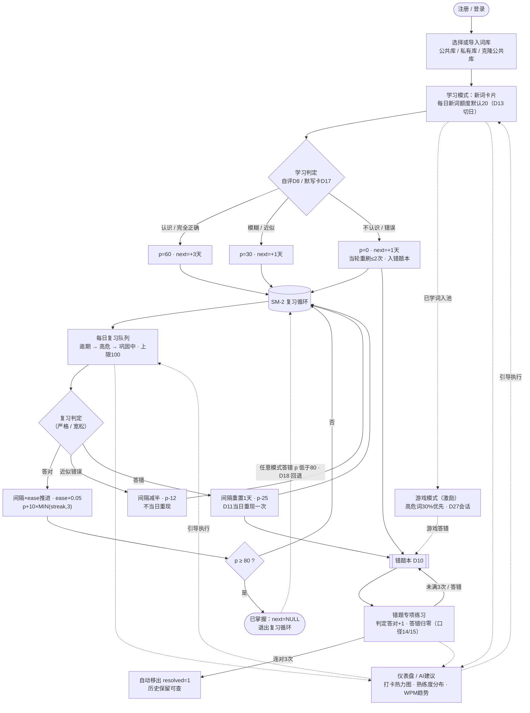
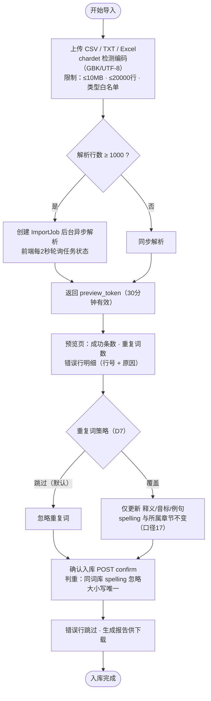
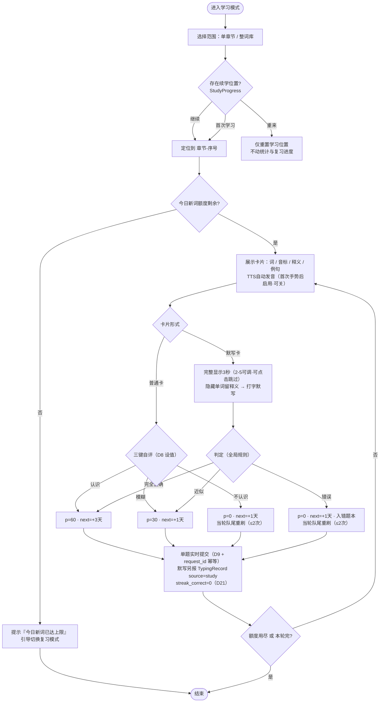
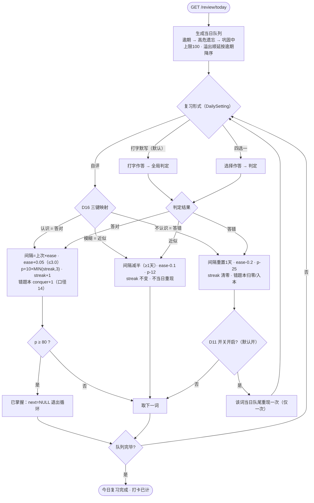
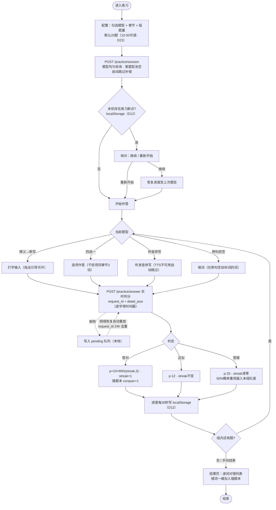
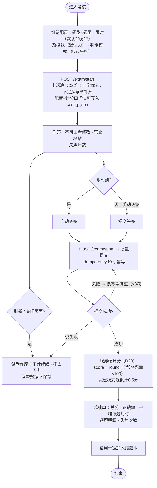
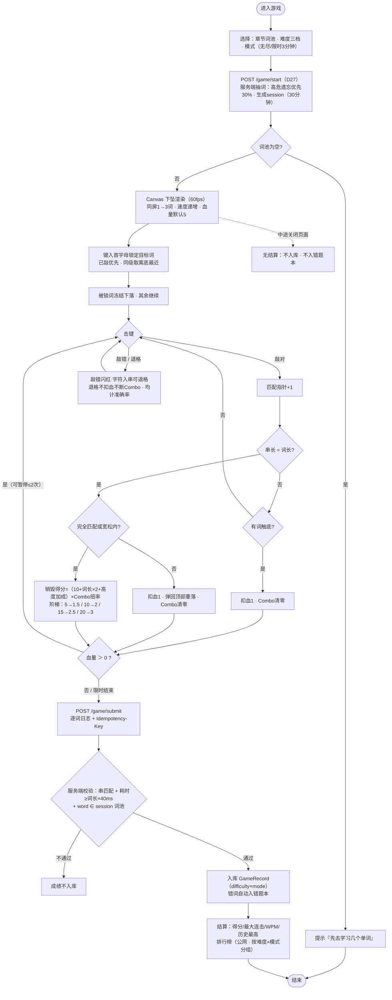
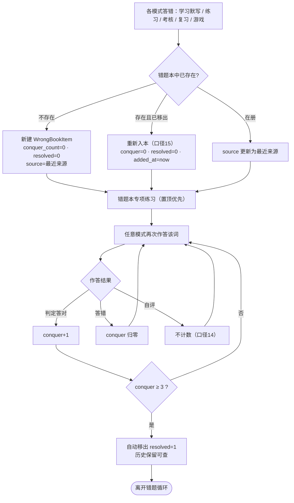
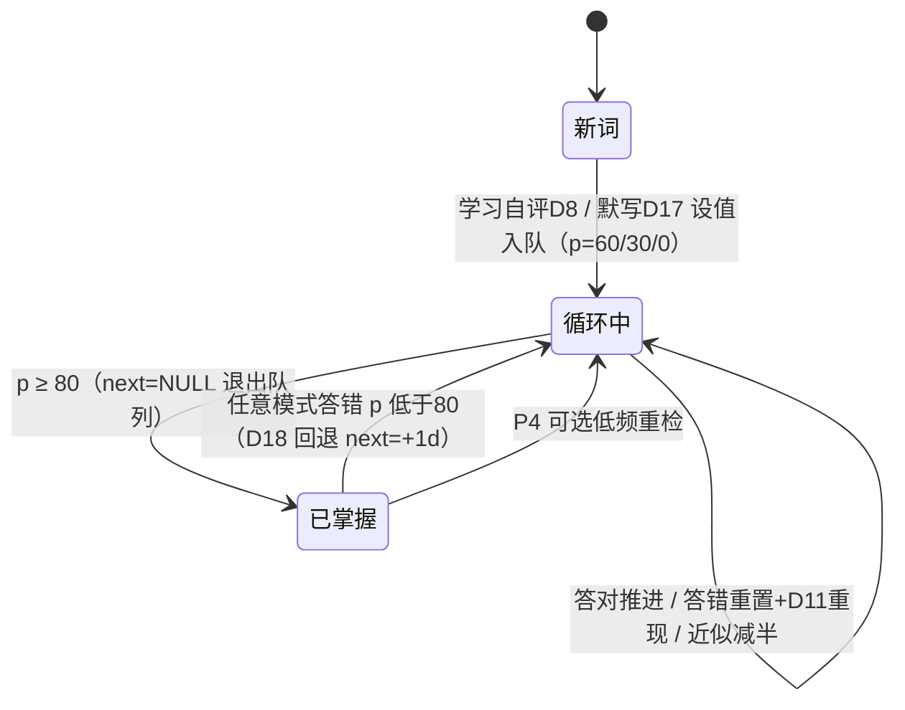

以下共 10 张图：1 张功能架构图 + 1 张业务总流程图 + 7 张核心子流程图 + 1 张生命周期状态图（对应附录 A）。全部采用 Mermaid 语法，可直接在 Typora / VS Code / 语雀 / GitHub 中渲染，节点内标注了对应决策号（D8、D17 等），便于与 v3.4 正文评审对照（v3.3/v3.4 新增 D29–D33 已回写）。
**图例约定**：实线 = 主流程；虚线 = 联动/异常分支；菱形 = 判定；`[[]]` = 子过程。
---------------------------------------------------------------------------------

## 图 1：功能架构图（分层）

---

## 图 2：业务总流程图（核心学习生命周期主线）

---

## 图 3：词库导入子流程（三步制）

---

## 图 4：学习模式子流程（D8 / D17 / 额度联动）

---

## 图 5：复习循环子流程（SM-2 + D16 映射 + D11 重现）

> 注：每次作答均单题实时提交（request_id 幂等，断网进 pending 重放 D19）；每次有效提交实时 upsert DailyActivity 计打卡（口径21）。

---

## 图 6：练习模式子流程（D12 断点续练 + D19 重放 + D23 组规格）

---

## 图 7：考核模式子流程（D20 / D22 / 中断作废 / 幂等交卷）

---

## 图 8：游戏模式子流程（D27 开局协议 + 附录 B 交互）

---

## 图 9：错题攻克子流程（D10 / 口径 14 / 口径 15）

---

## 图 10：单词生命周期状态图（对应附录 A）

---

## 使用建议

1. **文档插入位置**：建议作为新增「第十一章 图集」或「附录 D」，正文各模块处加交叉引用（如“流程见图 4”）；图 1 可同时挂在第三章「项目概述」之后作为架构总览。
2. **渲染**：以上均为标准 Mermaid 语法，Typora / VS Code（装 Mermaid 插件）/ 语雀 / GitHub 均可直接渲染；导出 PNG/SVG 可用 mermaid.live。
3. **评审对照**：每张图节点均带 D 编号/口径编号，P0–P3 验收用例可直接按图中分支逐一覆盖（例如图 6 的断网重放分支对应 P0 验收⑥）。
   如需补充**时序图**（D19 断网重放时序、D27 游戏开局/结算时序、滑动续期时序）、**泳道图**（管理员侧：邀请码发放/重置密码/公共词库维护）或转换为 **draw.io / PlantUML** 格式，告诉我即可。
