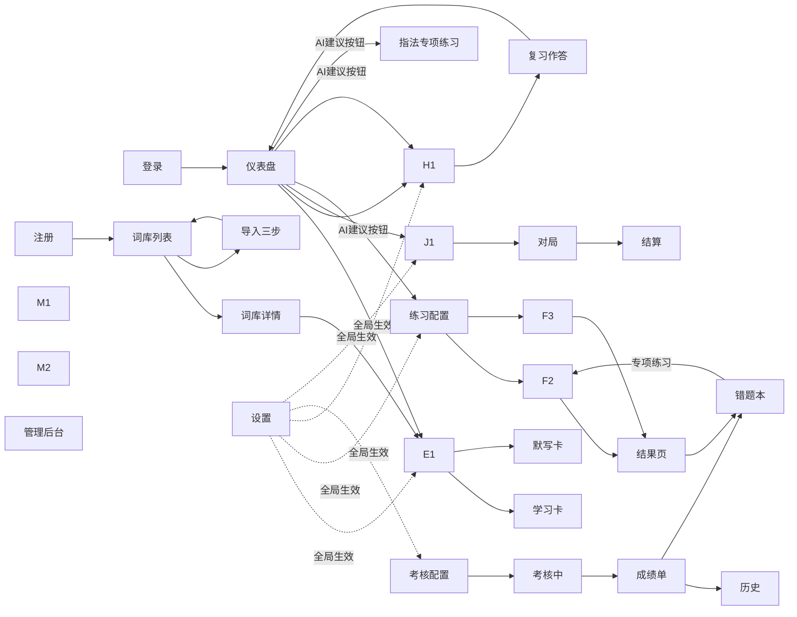

以下为 v3.1 配套的**低保真原型（线框图）**，共 24 屏 + 全局规范。全部用字符线框绘制（不依赖工具即可评审），每屏标注对应模块号与决策号，可直接作为 Axure/Figma 搭建蓝图。线框采用开放式右边框，避免中英文等宽差异导致的错位。
---
# 第〇部分：页面清单与信息架构
## 0.1 站点地图
```
WordType
├─ 认证：登录 / 注册（邀请码条件显示 D25）
├─ 主应用（全局框架 A1）
│  ├─ 仪表盘（AI建议 · 打卡热力图 · 图表）
│  ├─ 词库管理（列表 / 详情 / 导入三步 / 克隆）
│  ├─ 学习模式（入口 / 卡片 / 默写卡）
│  ├─ 练习模式（配置 / 答题×4题型 / 结果）
│  ├─ 复习模式（入口 / 作答×3形式）
│  ├─ 考核模式（配置 / 答题 / 成绩单 / 历史）
│  ├─ 游戏模式（大厅 / 对局 / 结算）
│  ├─ 错题本（列表 / 专项练习入口）
│  ├─ 个人中心（改密 / 导出 / 注销）
│  └─ 设置（8 组配置，D26）
└─ 管理后台（admin）：用户 / 邀请码 / AI 模型配置 / 公共词库
```
## 0.2 屏幕索引与追溯表
| 编号 | 屏幕 | 对应模块 | 关键决策/口径 |
|------|------|---------|--------------|
| A1 | 全局布局框架 | — | D13 日期口径、D2 多设备 |
| B1/B2 | 登录 / 注册 | 模块1 | D6、D14、D25 |
| C1 | 仪表盘 | 模块7、10 | D13、口径20/21、D24、D28 |
| D1–D3 | 词库列表/详情/导入 | 模块2 | D7、口径17、D25 |
| E1–E3 | 学习入口/卡片/默写卡 | 模块3 | D8、D9、D17、D21、口径23 |
| F1–F4 | 练习配置/答题/结果 | 模块4 | D12、D19、D23、口径18 |
| G1–G4 | 考核配置/答题/成绩/历史 | 模块5 | D20、D22、口径22 |
| H1–H2 | 复习入口/作答 | 模块8 | D11、D16 |
| I1 | 错题本 | 模块6 | D10、口径14/15 |
| J1–J3 | 游戏大厅/对局/结算 | 模块9 | D1、D27、口径19 |
| K1 | 设置 | DailySetting | D26 |
| L1 | 个人中心 | 模块1 | D14 |
| M1–M3 | 管理后台 | 模块1/2/10 | D6、D15、D25、D28 |
| P1 | 公共弹窗集合 | — | D18、D19、口径16 |
---
# 第一部分：全局框架
## A1 全局布局框架（桌面端 ≥1024px）
```
┌──────────────────────────────────────────────────────────────────
│ ◆ WordType 打字背单词      [🔍 全局搜索词库 ⌘K]     🔔   张三(admin)▾  ← 顶栏 56px
├────────────┬─────────────────────────────────────────────────────
│ ▣ 仪表盘    │
│ ▤ 词库管理  │
│ ────────── │
│ ✎ 学习模式  │
│ ⌨ 练习模式  │                    路 由 内 容 区
│ ↻ 复习模式  │               （第二部分各屏渲染于此）
│ ✓ 考核模式  │
│ ▶ 游戏模式  │
│ ────────── │
│ ⚑ 错题本 ③  │
│ ────────── │
│ ◔ 个人中心  │
│ ⚙ 设置     │
│ ────────── │
│ 🛡 管理后台  │ ←────────────── 仅 admin 角色可见（D15）
├────────────┴─────────────────────────────────────────────────────
│ 状态栏：服务器日期 2026-09-04（D13）│ 今日额度：新词 12/20 · 复习 30/100
└──────────────────────────────────────────────────────────────────
```
**标注：**
1. 底部状态栏日期强制取服务端返回（第二章「日期展示」口径），禁止前端自算——切日正确性的 UI 落点。
2. 错题本入口带未攻克数角标（resolved=0 计数）。
3. 左侧导航宽 200px；当前项高亮。
**响应式（<768px）**：侧栏收起为底部 Tab（仪表盘/学习/复习/游戏/更多）；游戏模式顶部固定横幅「⚠ 建议使用键盘设备体验（不提供降级玩法）」。
---
# 第二部分：各屏线框
## B1 登录页（模块 1）
```
┌────────────────────────────────
│              ◆ WordType
│           单词 × 打字 联合训练
│
│   用户名  [____________________ ]
│   密 码  [____________________ ]
│
│   [         登        录        ]
│   ─────────── 或 ───────────
│    注册新账号        忘记密码?
└────────────────────────────────
```
**标注：**
1. 登录失败统一提示「用户名或密码错误」——连续 5 次锁定时不泄露锁定状态（模块 1）。
2. 登录成功后若响应携带新 token（滑动续期），前端无感替换；token 存 `{userId}:token`。
3. 「忘记密码」→ 提示「请联系管理员重置」（D6）。
4. 登录成功 → 仪表盘 C1；服务端记录 logout 日志，前端登出 = 删 token + 清空本用户前缀缓存（D14）。
## B2 注册页（模块 1 / D25）
```
┌────────────────────────────────
│   用户名  [____________________ ]
│   ⓘ 3–20 字符，中英文/数字/下划线
│
│   密  码  [____________________ ]
│   强度：▂▃▅ 要求 ≥8 位含字母+数字
│   确认密码 [____________________ ]
│
│   邀请码  [____________________ ] ←─ 仅公网+开关开启时显示（D25）
│
│   [         注        册        ]
└────────────────────────────────
```
**标注：**
1. 邀请码字段由 `GET /api/settings`（公共部分）或注册页初始化接口决定显隐；错误提示区分「邀请码无效/已被使用/已过期」。
2. 注册成功自动登录 → 引导页「导入/克隆第一本词库」→ D1。
## C1 仪表盘（模块 7、10）
```
┌─ 仪表盘 ────────────────────────────────────────────────────────
│ ┌ AI 今日建议 ────────────────────────────────────────────────┐
│ │ 💡 错误率>60% 的词共 12 个               [立即专项练习 →]    │
│ │ 💡 高危遗忘词明日到期 8 个               [现在复习 →]        │
│ │ 💡 最慢字母组合 "th / ion" Top5          [指法专项 →]        │
│ │                            [↻ 刷新  今日手动刷新 1/3]       │
│ └─────────────────────────────────────────────────────────────┘
│
│ ┌─────────┐┌─────────┐┌─────────┐┌─────────┐
│ │今日待复习 ││今日新学  ││ 连续天数 ││ 本周WPM  │
│ │   23    ││  12/20  ││  7 天 🔥 ││   45    │
│ └─────────┘└─────────┘└─────────┘└─────────┘
│
│ ┌ 打卡热力图（近12周）── 连续 7 天 ┐ ┌ 熟练度分布 ────────┐
│ │ 一 □□□▪■■□■■■■■ …             │ │ 已掌握 34% ▓▓▓    │
│ │ 二 □▪■■■■■■■■□■               │ │ 巩固中 41% ▓▓▓▓   │
│ │ 三 ■■■□▪■■■□■■■  （□→■ 4档）  │ │ 高危   25% ▓▓     │
│ └──────────────────────────────┘ └───────────────────┘
│
│ ┌ WPM / 准确率趋势（30天，可按模式筛选 ▾）┐ ┌ 未来7天复习量 ┐
│ │ 50│            ╭──╮                  │ │ 今天 │███ 12 │
│ │ 40│  ╭─╮   ╭──╯   ╰─╮               │ │ +1天 │████ 23│
│ │ 30│──╯  ╰──╯        ╰──             │ │ +2天 │██ 8   │
│ │    [练习|复习|考核|全部]             │ │ …   │       │
│ └──────────────────────────────────┘ └──────────────┘
└─────────────────────────────────────────────────────────────────
```
**标注：**
1. 建议卡按固定优先级取前 3（口径 20）：错误率>60% → 高危明日到期 → 连续 7 天未学 → 指法专项；每条按钮直跳对应模式并携带范围参数。
2. 手动刷新计数展示（D28：LLM 开启时限 3 次/日；规则版不限但缓存按 D13 切日失效）。
3. 热力图数据源 DailyActivity（口径 21 实时 upsert，当天格子点击后立即点亮）。
4. WPM 趋势支持按 TypingRecord.source 筛选（v3.1 模型增补）。
5. 「今日待复习」卡片点击 → H1；「新学」卡片点击 → E1。
6. LLM 周报开启时此区顶部追加横幅：「AI 周报已启用，数据将发送至 api.xxxx.com（不含个人标识）」。
## D1 词库列表页（模块 2）
```
┌─ 词库管理 ────────────────────────── [+导入词库] [+新建词库] ────
│ Tab: [我的词库]  [公共词库]                    🔍 搜索词库…
│
│ ┌───────────┐ ┌───────────┐ ┌───────────┐ ┌───────────┐
│ │ 📕 CET-4   │ │ 📕 雅思6.5 │ │ 🌐 考研5500 │ │   ＋ 新建  │
│ │ 12章·4213词│ │ 8章·2600词 │ │ 22章·5500词 │ │           │
│ │ ███████░░  │ │ ███░░░░░░  │ │  [克隆为私有]│ │           │
│ │  已学56%   │ │  已学30%   │ │            │ │           │
│ │ [学习][管理]│ │ [学习][管理]│ │ [预览][克隆] │ │           │
│ └───────────┘ └───────────┘ └───────────┘ └───────────┘
└─────────────────────────────────────────────────────────────────
```
**标注：**
1. 克隆卡片标注来源「🌐=公共词库」；克隆后命名「原名-副本」，不复制统计（模块 2）。
2. 管理员在公共词库 Tab 额外看到 [编辑] [设为公共/取消] [删除]。
## D2 词库详情（单词列表）
```
┌─ CET-4 核心词汇 ───────────── [＋添加单词] [导出CSV] [章节管理] ──
│ 章节 Tab: [U1 ▾][U2][U3]… [全部]        🔍 搜索单词/释义 (q=)
│ ─────────────────────────────────────────────────────────────
│  单词          释义                音标           操作
│ ─────────────────────────────────────────────────────────────
│  abandon      v.放弃;遗弃         /əˈbændən/    编辑 删除
│  ability      n.能力              /əˈbɪləti/    编辑 删除
│  …（5000+ 词虚拟滚动）                                          │
│ ─────────────────────────────────────────────────────────────
│                              ‹ 1 2 3 … 85 ›   每页 50 ▾
└─────────────────────────────────────────────────────────────────
```
**标注：**
1. 删除 = 软删（deleted_at/deleted_by 留痕），二次确认弹窗注明「相关学习统计将保留」。
2. 导出 CSV 公式注入转义（= + - @ 前置 `'`）。
3. 搜索走 `?q=` 分页接口；列表 5000+ 采用虚拟滚动。
## D3 导入三步流程（模块 2 / D7 / 口径 17）
```
【Step ① 上传】
┌─ 导入词库 ──  ① 上传 ──── ② 预览 ──── ③ 完成 ──────────────────
│
│      ┌───────────────────────────────┐
│      │      ⬆ 拖拽文件到此处 / 点击选择   │
│      │   支持 CSV / TXT / Excel        │
│      │   ≤10MB · ≤20000 行             │
│      └───────────────────────────────┘
│      ⓘ 首行表头：单词, 释义, 音标(选), 例句(选)
│      [目标词库: 新建「CET-6」▾ 或 追加到已有词库 ▾]
└─────────────────────────────────────────────────────────────────
【Step ② 预览】
┌─ 解析完成 · 预览 ────── ⏱ 预览保留 29:41 ───────────────────────
│  ✓ 成功 1980 条   ⚠ 重复 15 条   ✗ 错误 5 条
│
│  重复词处理（D7）： (●) 跳过   ( ) 覆盖
│                    └ 覆盖=仅更新释义/音标/例句，
│                      拼写与所属章节不变（口径17）
│
│  错误行明细（行号+原因）：                    [下载错误报告]
│  ──────────────────────────────────────────
│  行 23   缺少释义字段
│  行 156  单词含非法字符
│ ──────────────────────────────────────────
│            [← 重新上传]      [确认入库 →]
└─────────────────────────────────────────────────────────────────
【Step ③ 完成】
┌─ 入库完成 ──────────────────────────────────────────────────────
│   ✓ 成功导入 1980 词（跳过重复 15 · 跳过错误 5）
│   [下载导入报告]   [前往词库 →]   [继续导入]
└─────────────────────────────────────────────────────────────────
```
**标注：**
1. ≥1000 行时 Step① 点击上传后立即显示「后台解析中…」进度条，前端每 2s 轮询 jobId（v3.1）。
2. Step② 顶部倒计时 = preview_token 30 分钟有效期；超时按钮置灰并提示重新上传。
3. GBK 文件由 chardet 自动转换，无需用户选择编码（P0 验收②）。
## E1 学习模式入口（模块 3）
```
┌─ 学习模式 ──────────────────────────────────────────────────────
│ 选择范围：  (●) 单章节  [CET-4 ▾] [U3 高频词 ▾]
│            ( ) 整词库  [CET-4 ▾]
│
│ ┌ 续学提示弹窗 ─────────────────────────┐
│ │  上次学到《CET-4》U3 第 14 词           │
│ │  [  继续学习  ]    [  重新开始  ]       │
│ │  ⓘ 重新开始仅重置学习位置，              │
│ │    不影响熟练度与复习进度（v3.1 锁定）    │
│ └───────────────────────────────────────┘
│
│ 今日新词剩余额度：████████░░ 12/20
│ [ 开始学习 → ]
└─────────────────────────────────────────────────────────────────
```
**标注：** 额度条数据来自 `GET /api/study/next`；为 0 时按钮替换为提示卡（见 P1-1）。
## E2 学习卡片——自评态（模块 3 / D8）
```
┌───────────────────────────────────────────
│  第 14 / 40 词          U3 高频词    🔊 自动
│
│              abandon
│            /əˈbændən/
│          v. 放弃；遗弃
│   They abandoned the car in the snow.
│
│  ┌───────────┐ ┌───────────┐ ┌───────────┐
│  │  ✗ 不认识  │ │  ？ 模糊   │ │  ✓ 认 识  │
│  │   熟练度 0 │ │   熟练度 30│ │   熟练度 60│
│  └───────────┘ └───────────┘ └───────────┘
│    快捷键 [1]      [2]           [3]
└───────────────────────────────────────────
```
**标注：**
1. TTS 自动发音在首次用户手势后启用；speechSynthesis 异常 → 隐藏 🔊 按钮（口径 23）。
2. 三键下方展示设值语义（D8），帮助用户理解「模糊≠答错一半」。
3. 选「不认识」→ 卡片飞入队尾并显示角标「稍后重现 1/2」（同词最多重刷 2 次）。
4. 提交携带 request_id（D9/D19），断网时卡片右下角出现 P1-3 重放提示条。
## E3 默写卡——双状态（模块 3 / D17）
```
【状态 A：完整展示（默认3s，设置可调2–5s）】
┌───────────────────────────────────────────
│   ◔◔◔ 3 秒后开始默写            [跳过展示 ▸]
│
│              abandon
│            /əˈbændən/  v. 放弃
└───────────────────────────────────────────
【状态 B：隐藏单词，打字默写】
┌───────────────────────────────────────────
│  释义：v. 放弃；遗弃
│  例句：They ________ the car in the snow.
│
│  输入：a b a n d o n █
│        ✓✓✓✓✓✓✓
│
│  判定反馈：  ✓ 完全正确 → p=60 · 3天后复习
│             ≈ 近似     → p=30 · 明天复习
│             ✗ 错误     → p=0 · 明天复习 · 稍后重现
└───────────────────────────────────────────
```
**标注：**
1. 状态 A 展示期不计入 WPM 有效时长（口径 13）；可点击跳过。
2. 判定反馈三行文案在结果瞬间展示对应一行，1.5s 后自动进入下一词。
3. 默写答错自动入错题本 source=study（D17），与练习错词入口统一。
4. 输入框自动聚焦；中文输入法场景处理见「全局规范 5.3 IME」。
## F1 练习配置页（模块 4 / D23）
```
┌─ 练习模式 ──────────────────────────────────────────────────────
│ 题型（可多选）：
│  [✓] 释义 → 打字默写（默认）
│  [✓] 四选一选择题
│  [ ] 听音拼写        ⓘ TTS 不可用时自动跳过
│  [ ] 例句挖空填词    ⓘ 仅含目标词例句的词参与（口径18）
│
│ 范围：  [CET-4 ▾] [U3 ▾]
│ 本组题量：  ├──●──────┤ 20 题（10–50 可调，D23）
│ 判定：  (●) 宽松（Levenshtein≤1 记近似）  ( ) 严格
│ 指法引导： [✓] 虚拟键盘高亮
│
│ [ 开始练习（预计 15 分钟）→ ]
└─────────────────────────────────────────────────────────────────
```
## F2 练习答题——打字默写题型（模块 4）
```
┌─ 练习 5/20 ─────────────────── WPM 42 │ 准确率 96% │ [✕ 结束组] ─
│ ████████░░░░░░░░░░░░ 进度条
│
│        v. 放弃；遗弃
│
│   ┌ ┌ ┌ ┌ ┌ ┌ ┌ ┌ ┐
│   │a│b│a│n│d│ │ │ │      ← 已输入逐字回显（绿=对 红=错）
│   └ └ └ └ └ └ └ └ ┘
│
│  ┌───┬───┬───┬───┬───┬───┬───┬───┬───┬───┐
│  │ Q │ W │ E │ R │ T │ Y │ U │ I │ O │ P │   ← 虚拟键盘
│  ├───┼───┼───┼───┼───┼───┼───┼───┼───┼───┤      下一键高亮
│  │ A │ S │ D │ F │ G │ H │ J │ K │ L │   │      + 手指分区底色
│  └───┴───┴───┴───┴───┴───┴───┴───┴───┴───┘
│
│ ⬆ 2 条记录待同步（断网期间已暂存）… 已自动重放 ✓    ← D19 提示条
└─────────────────────────────────────────────────────────────────
```
**标注：**
1. 每题实时提交（D9），失败进 pending 队列，顶部黄色提示条展示重放状态，重放成功自动消失。
2. 进度每 30s 写 localStorage（D12）；「✕ 结束组」触发确认弹窗，已答部分正常计分（D23）。
3. 逐字母时间戳写入 detail_json，页面无感。
4. 「结束组」后跳 F4。
## F3 练习答题——四选一题型（模块 4）
```
┌─ 练习 6/20 ─────────────────────────────────────────────────────
│
│            🔊 abandon        /əˈbændən/
│
│  释义是？
│  ┌─────────────────────────────────┐
│  │ A. n. 能力；才能                  │
│  │ B. v. 放弃；遗弃          ← 选中  │
│  │ C. n. 学院                       │
│  │ D. v. 吸收；理解                  │
│  └─────────────────────────────────┘
│  快捷键 [A][B][C][D] 或 [1][2][3][4]
└─────────────────────────────────────────────────────────────────
```
**标注：** 干扰项同章节取 3 个不同释义的词，不足时从同词库补；与正确项释义重复时重新抽取（v3.1 备忘 4）。
## F4 练习结果页（模块 4）
```
┌─ 本次练习结果 ──────────────────────────────────────────────────
│  WPM 45 │ 准确率 94% │ 用时 8'32" │ 答对 16/20（近似 2）
│
│  逐词明细：
│  ────────────────────────────────────────────
│  ✓ abandon    0.8s   WPM 52
│  ≈ abbreviate 输入"abbrieviate"   [加入错题本]
│  ✗ abundant   输入"abudant"       [✓ 已加入]
│  …
│  ────────────────────────────────────────────
│  [ 全部错词加入错题本 (3) ]        [再来一组] [返回]
│
│  本组逐字母延迟热力图（缩略）：
│  a b c d e f g …    （慢键偏红，详见仪表盘 LetterStat）
└─────────────────────────────────────────────────────────────────
```
## G1 考核配置页（模块 5 / D20 / D22）
```
┌─ 发起考核 ──────────────────────────────────────────────────────
│ 范围章节：  [CET-4 ▾] [U3 ▾]
│ 题型 × 题量：
│   打字默写  [ - ] 10 [ + ]      四选一  [ - ] 5 [ + ]
│   听音拼写  [ - ] 0 [ + ]      例句挖空 [ - ] 5 [ + ]
│ 限时：  [ 20 ] 分钟        及格线：  [ 60 ] 分
│ 判定：  (●) 严格（默认）   ( ) 宽松（近似记 0.5 分，D20）
│
│ ⓘ 出题规则：优先取本范围已学词，不足时从章节内随机补齐（D22）
│ ⚠ 考核中不可回看修改、不可粘贴；中途关闭页面试卷作废
│
│ [ 开始考核 → ]
└─────────────────────────────────────────────────────────────────
```
## G2 考核答题页（模块 5）
```
┌─ 考核中 ──────────────────────────────── ⏱ 剩余 18:32 ──────────
│  第 5 / 20 题      已答 4      （只能前进，不可回看）
│
│        v. 放弃；遗弃
│   输入：[ a b a n d o n █          ]
│
│  [ 下一题 → ]
│
│  ──────────────────────────────────────────────
│  [✕ 放弃并离开]   ⓘ 失焦行为将被记录（不实时提示）
│  ⚠ 本页禁用粘贴；关闭/刷新页面 = 试卷作废
└─────────────────────────────────────────────────────────────────
```
**标注：**
1. 顶部计时器 <60s 变红闪烁；到时自动交卷，失败携幂等键重试 3 次，仍失败提示「网络中断，本卷作废」（口径 22）。
2. beforeunload 拦截；「放弃并离开」二次确认（P1-4）。
3. blur 计数仅写入成绩单，不实时提示（建议项，防规避）。
4. 所有答案本地暂存，交卷时批量提交 + Idempotency-Key（D9）。
## G3 考核成绩单（模块 5）
```
┌─ 考核成绩 ──────────────────────────────────────────────────────
│                    ┌────────┐
│                    │  82 分  │   ✅ 及格（及格线 60）
│                    └────────┘
│  正确率 82% │ 用时 16'40" │ 平均每题 50s │ 失焦 2 次
│  本次配置快照：默写10+选择5+挖空5 · 20分钟 · 严格判定（存 config_json）
│
│  逐题明细：
│  ────────────────────────────────────────────
│  #1  abandon     ✓ 42s
│  #2  abbreviate  ≈(宽松半分) 58s   [加入错题本]
│  #3  abundant    ✗ 61s            [✓ 已加入]
│  …
│  ────────────────────────────────────────────
│  [ 错词全部加入错题本 (4) ]   [查看历史趋势] [返回]
└─────────────────────────────────────────────────────────────────
```
## G4 历史成绩列表（模块 5）
```
┌─ 考核历史 ──────────────────────────────────────────────────────
│  趋势折线图（近10次）：  100│      ╭╮
│                          80│ ╭──╮╭╯ ╰╮ ← 及格线 60 虚线
│                          60│─╯  ╰╯    ╰─
│  ─────────────────────────────────────────────
│  09-04 14:20  82分  CET-4/U3  20题  16'40"  查看
│  09-02 09:10  75分  CET-4/全部 20题 19'02"  查看
└─────────────────────────────────────────────────────────────────
```
## H1 复习模式入口（模块 8）
```
┌─ 今日复习 ───────────────────────────── 服务器日期 2026-09-04 ──
│  待复习队列：
│   🔴 逾期词 12   🟠 高危遗忘 8   🟡 巩固中 15        共 35
│   今日剩余额度：██░░ 10/100（溢出顺延，按逾期天数降序补）
│
│  复习形式（设置可改）：
│   (●) 打字默写（默认）   ( ) 四选一   ( ) 自评三键（D16 映射）
│
│  [ 开始复习 → ]
└─────────────────────────────────────────────────────────────────
```
## H2 复习作答——自评形式变体（模块 8 / D16）
```
┌─ 复习 3/10 ─────────────────────────────────────────────────────
│              abandon
│            /əˈbændən/  v. 放弃
│
│  ┌──────────┐ ┌──────────┐ ┌──────────┐
│  │ ✗ 不认识  │ │ ？ 模糊   │ │ ✓ 认识   │
│  └──────────┘ └──────────┘ └──────────┘
│
│  ⓘ 本次自评含义（D16）：
│    认识=间隔推进 · 模糊=间隔减半 · 不认识=明天重来+当日重现
└─────────────────────────────────────────────────────────────────
```
**标注：**
1. 与学习卡 D8 的本质区别：复习自评走映射（D16），不设值——底部常驻提示避免用户混淆。
2. 答错且 D11 开启时，卡片角标「本词今日将重现 1 次」。
3. 打字/选择形式的作答页复用 F2/F3 布局，仅顶部标题换为「复习」。
## I1 错题本（模块 6 / D10 / 口径 14/15）
```
┌─ 错题本 ────────── [▶ 错题专项练习] ── 筛选: [在册▾][来源▾] ────
│ ───────────────────────────────────────────────────────────────
│ 📌 abandon    来源:考核   攻克 ●●○ 2/3   入本 09-01  [练习][移出]
│    abundant   来源:练习   攻克 ○○○ 0/3   入本 09-03  [练习][移出]
│    abbreviate 来源:复习   攻克 ●○○ 1/3   入本 08-28  [练习][移出][置顶]
│  已攻克 (12) ▸ 查看（resolved=1，历史保留可查）
│ ───────────────────────────────────────────────────────────────
│  ⓘ 规则：任意模式判定答对 +1，连对 3 次自动移出；答错归零；
│    已移出的词再答错将自动重新入本并归零（口径15）
└─────────────────────────────────────────────────────────────────
```
## J1 游戏大厅（模块 9 / D27）
```
┌─ 游戏模式 · 下坠打字 ───────────────────────────────────────────
│  难度：  ┌──────┐ ┌──────┐ ┌──────┐
│          │ 轻松  │ │ 标准●│ │ 地狱  │   ← 初速/加速度/同屏数
│          └──────┘ └──────┘ └──────┘
│  模式：  ( ) 无尽（血条制）    (●) 限时 3 分钟
│  词池：  [✓] CET-4 U1  [✓] U2  [ ] U3
│          ⓘ 高危遗忘词将优先抽取约 30%（服务端执行，D27）
│  历史最高：标准·限时 3,240 分
│
│  [ 开始游戏 → ]        ⚠ 建议键盘设备（移动端显示）
└─────────────────────────────────────────────────────────────────
```
## J2 游戏对局（模块 9 / 附录 B）
```
┌─────────────────────────────────────────────────────────────────
│ ❤❤❤❤❤  得分 1280   连击 7 → ×1.5   ⏸ 暂停(剩2次)   02:14 ⏱
│                                                                 │
│          f l o w e r                                            │
│                     a p p l e   ← 已敲"ap"，冻结中（高亮框）      │
│    w o r d                                                      │
│                        s n o w █ ← 敲错字符标红，可退格           │
│                                                                 │
│  ─────────────── 底部落地区 ────────────────────────────────────
│  输入串：[ a p █            ]   ⌫ 退格不断连击
└─────────────────────────────────────────────────────────────────
【暂停遮罩层】
┌─────────────────────┐
│   已暂停（剩 1 次）    │
│  [继续]  [放弃本局]   │
└─────────────────────┘
```
**标注：**
1. 锁定词视觉：描边+冻结（不下落）；其余词正常下落（附录 B 步骤 1–2）。
2. 输入串长度=词长时自动判定，无提交键：成功→销毁飘分「+18 ×1.5」；失败→扣血+词弹回顶部+连击清零（D1）。
3. 血量 0 / 限时到 → J3；中途关闭页面 → 无结算不入库（v3.1 附录 B 步骤 8），下次进入大厅提示。
4. Canvas 60fps，前端本地渲染判定，仅结算时批量提交逐词日志（D9）。
## J3 游戏结算（模块 9）
```
┌─ 本局结算 ──────────────────────────────────────────────────────
│            🏆 新纪录！  3,240 分
│   最大连击 ×2.0 │ 正确 32 词 │ 本局 WPM 51
│   错词 4 个已自动加入错题本
│
│   排行榜（标准·限时）Top5：        ← 仅公网部署显示
│    1. alice    4,210
│    2. 我        3,240  ←
│
│   [ 再来一局 ]   [ 返回大厅 ]
└─────────────────────────────────────────────────────────────────
```
## K1 设置页（DailySetting / D26）
```
┌─ 设置 ──────────────────────────────────────────────────────────
│ ▾ 学习额度
│   每日新词上限   [ 20 ] (0–100)
│   每日复习上限   [100] (0–200)
│ ▾ 学习
│   默写卡展示秒数 ├─●──┤ 3s (2–5)
│ ▾ 复习
│   复习形式   (●)打字默写 ( )四选一 ( )自评
│   答错当日重现 [✓]（D11）
│ ▾ 练习
│   宽松判定   [✓]   组题量 [20] (10–50)   指法引导 [✓]
│ ▾ 考核
│   限时 [20]min   及格线 [60]   宽松计分 [ ]
│ ▾ 游戏
│   难度 (●)标准   模式 (●)无尽 ( )限时
│
│                    [ 保存 ]   ⓘ 部分更新+范围校验（D26）
└─────────────────────────────────────────────────────────────────
```
## L1 个人中心（模块 1）
```
┌─ 个人中心 ──────────────────────────────────────────────────────
│  👤 张三   角色：user   注册于 2026-06-01
│  [修改密码]  → 旧密码+新密码（≥8位含字母数字）
│  [导出我的数据]  → 个人全量 CSV 包（/api/export/account）
│  ────────────────────────────────
│  [注销账号]  ⚠ 软删除保留 30 天，期间可联系管理员恢复；
│              30 天后数据将被物理清理
└─────────────────────────────────────────────────────────────────
```
## M1 管理后台——用户管理（模块 1 / D6 / D15）
```
┌─ 用户管理 ───────────────────── 🔍 搜索   共 86 人 ──────────────
│ ───────────────────────────────────────────────────────────────
│ ID  用户名    角色    状态        注册时间     操作
│ 1   admin    admin  正常        2026-06-01  （内置账号）
│ 12  bob      user   正常        2026-07-12  [重置密码]
│ 33  carol    user   已注销(剩12天) 2026-08-01 [恢复] [重置密码]
│ ───────────────────────────────────────────────────────────────
│
│ 【重置密码弹窗】
│  ┌──────────────────────────────┐
│  │ 临时密码（仅显示一次，请复制）： │
│  │  Kp7#mQx2                     │
│  │  [复制]          [已告知用户，关闭] │
│  └──────────────────────────────┘
└─────────────────────────────────────────────────────────────────
```
**标注：** 临时密码随机生成一次性展示（v3.1 D6）；重置即 pwd_ver+1，该用户所有旧 token 立即 401（口径 16）。
## M2 管理后台——邀请码（D25）
```
┌─ 邀请码管理 ── [批量生成 ▾ 10枚 / 有效期30天] ── 开关:[公网注册需邀请码 ●开]
│ ───────────────────────────────────────────────────────────────
│ 码             状态      使用者     过期时间     操作
│ W8KQ-2MNP     未使用     —         2026-10-01  [停用][复制]
│ A1B2-C3D4     已使用     bob       2026-09-15  —
│ X9Y8-Z7W6     已停用     —         2026-09-20  —
└─────────────────────────────────────────────────────────────────
```
## M3 管理后台——AI 模型配置（D28）
```
┌─ AI 建议配置 ───────────────────────────────────────────────────
│ 建议引擎：  (●) 规则引擎（默认，免费）   ( ) LLM 自定义接入
│
│ ── LLM 配置（OpenAI 兼容协议）──
│  API 地址  [ https://open.xxxx.com/v1        ]
│  API Key   [ ************abcd ]  ⓘ AES 加密存储，仅尾4位回显
│  模型名称  [ glm-4-flash                     ]
│  温度 [0.7]   超时 [30]s
│  [ 测试连接 ]  → ✓ 连接成功（延迟 380ms）
│
│  ⚠ 出域提示（开启后展示于仪表盘）：
│     数据将发送至 open.xxxx.com，仅含统计聚合与单词拼写，
│     不含用户名等个人标识
└─────────────────────────────────────────────────────────────────
```
**标注：** 调用失败静默回落规则引擎；手动刷新限 3 次/人/日（D28）。
## P1 公共弹窗集合
```
【1. 今日新词额度用尽】（E1 额度=0 时）
  ┌────────────────────────────┐
  │ 今日新词已达上限（20/20）     │
  │ 明天再来，或先复习旧词吧 →    │
  │ [ 去复习 ]   [ 返回 ]        │
  └────────────────────────────┘
【2. 练习退出确认】（F2 点 ✕）
  ┌────────────────────────────┐
  │ 结束本组练习？已答 12 题将正常计分 │
  │ 进度已本地保存，可稍后继续（D12）  │
  │ [ 继续练习 ]  [ 结束并看结果 ]   │
  └────────────────────────────┘
【3. 断线重放提示条】（D19，答题页顶部，非阻断）
  ⬆ 2 条记录待同步… 已自动重放 ✓（request_id 去重，不会重复计数）
【4. 考核放弃确认】（G2）
  ┌────────────────────────────────┐
  │ ⚠ 放弃后本卷作废：不计成绩、不占历史 │
  │ [ 继续作答 ]   [ 确认放弃 ]      │
  └────────────────────────────────┘
【5. 已掌握词回退提示】（D18，任意模式答错已掌握词时 toast）
  💡「abandon」已掌握状态被打破，明天将重新安排复习
```
---
# 第三部分：页面流转图（导航关系）

---
# 第四部分：全局组件与交互规范
## 4.1 判定反馈三色规范（贯穿所有答题场景）
| 状态 | 视觉 | 文案口径 |
|------|------|---------|
| ✓ 完全正确 | 绿色 #52c41a | 按答对处理（p+10×MIN(streak,3)，错题本+1） |
| ≈ 近似 | 黄色 #faad14 | 「接近了！按答错计熟练度，但不重置复习计划」（近似口径可视化） |
| ✗ 错误 | 红色 #f5222d | 按答错处理（p−25，streak 清零，入错题本） |
## 4.2 键盘优先交互（打字产品核心）
1. **输入框自动聚焦**：进入任何打字题页面，焦点立即落入输入框，无需点击。
2. **IME 处理（重要）**：打字题输入框 `compositionstart/end` 事件期间暂停逐字判定；检测到中文输入法激活时，顶部提示「请切换至英文输入模式」。
3. **快捷键**：自评三键 `1/2/3`；四选一 `A–D` 或 `1–4`；默写卡跳过 `Tab`；确认 `Enter`（游戏除外，自动判定无提交键）。
4. **退格语义**：练习/默写退格自由使用不计准确率分母；游戏内退格不断 Combo（附录 B 步骤 6）。
## 4.3 空状态与防呆
| 场景 | 文案 |
|------|------|
| 游戏词池为空 | 「先去学习几个单词，再来挑战吧」+ [去学习] |
| 复习队列为空 | 「今日复习已完成 🎉 明天见」 |
| TTS 不可用 | 听音拼写题型隐藏 + 设置页发音开关置灰 |
| 练习某题型池为空 | 出题时自动跳过该题型（用户无感，组内按比例补偿） |
## 4.4 原型→开发映射建议
- 本线框每屏对应一个 React 路由组件；弹窗集合 P1 建议抽成公共组件（`QuotaDialog` / `ExitConfirm` / `OfflineSyncBar` / `MasteredBrokenToast`）。
- 判定三色反馈、虚拟键盘、重放提示条为三个复用度最高的组件，建议 P0 先行。
- P0–P3 验收用例可按本原型逐屏反推：如 F2 的离线提示条 = P0 验收⑥的 UI 载体；M1 重置弹窗 = 口径 16 的 UI 载体。
---
**收尾**：如需下一步，我可以 ① 输出各屏的**高保真视觉规范**（色板/字号/间距 token 表）；② 把线框转成 **Figma 页面结构清单**（Frame 名/组件/变量命名，可直接照建）；③ 补充**移动端专项布局**（底部 Tab 五宫格 + 游戏横屏提示方案）。
