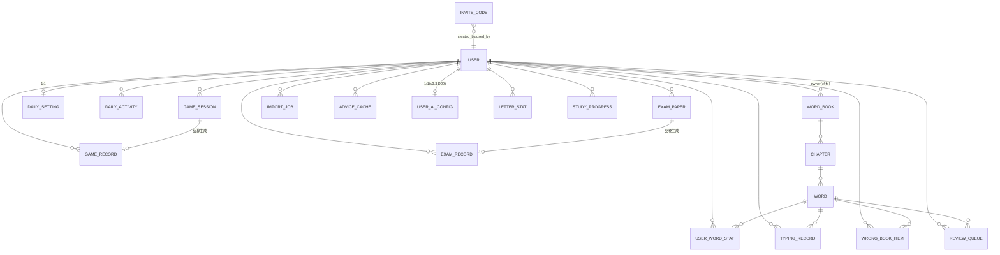
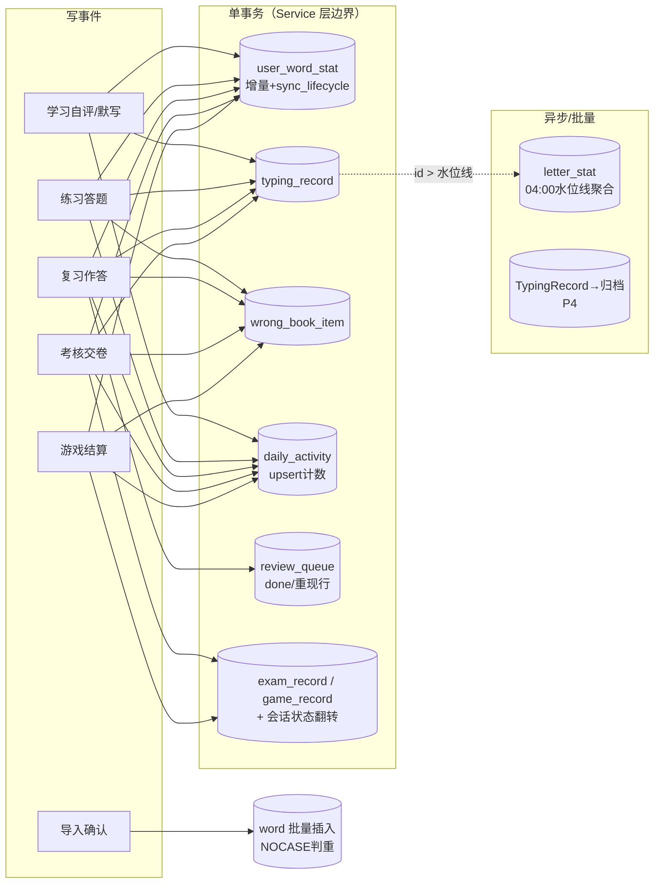

以下为**数据库设计文档（DBD v1.1）**，将 v3.4 第六章的模型细化为可直接建库的 DDL，并给出完整数据流转逻辑（事件→字段变更矩阵、事务边界、聚合流水线、读路径 SQL）。过程中发现 3 处必须落库才能闭环的缺口（复习队列、考核卷、建议缓存），已补表并标注 〔DBD新增〕；发现 4 处字段级细化，标注 〔DBD细化〕；全部差异在第十节汇总，需回写评审。
---
# 数据库设计文档 v1.1
### WordType · 配套《需求规格说明书 v3.4》与《架构设计 AD v1.1》
---
## 〇、设计约定（全库强制）
| # | 约定 | 内容 |
|---|------|------|
| C1 | 方言 | SQLite 3.35+（部分索引/ON CONFLICT 均依赖）；命名 snake_case 单数；主键一律 `INTEGER PRIMARY KEY`（rowid 别名）自增；外部生成的 token 类主键用 `TEXT`（uuid） |
| C2 | 时间 | 时间戳 `TEXT` ISO8601 `'YYYY-MM-DD HH:MM:SS'`，**服务器本地时区**（D13，`datetime('now','localtime')`）；纯日期 `TEXT` `'YYYY-MM-DD'`。迁移 PG 时时间戳换 `timestamptz`、日期换 `date`（见第九节） |
| C3 | 布尔 | `INTEGER 0/1`，不用真布尔类型（PG 迁移时映射 boolean） |
| C4 | 枚举 | `TEXT + CHECK` 约束（不用 int 枚举，可读性优先）；枚举值扩充=一次 Alembic 迁移 |
| C5 | JSON | `TEXT` 存 JSON，pydantic 在应用层校验；不入库索引；大小上限：detail_json ≤ 16KB、parsed_json ≤ 8MB（应用层截断报错） |
| C6 | 软删 | 业务表 `is_deleted + deleted_at(+deleted_by)`；**一切业务查询必须过滤 is_deleted=0**（Repository 基类）；物理删除仅发生在账号清理任务 |
| C7 | 删除策略 | 所有 `user_id` 外键声明 `ON DELETE CASCADE`（账号物理清理依赖）；`word_id` 外键不级联（词只软删，物理删除随清理任务显式处理） |
| C8 | 规范化 | `spelling` 按用户输入原样存储（展示用），判重/judgment 统一在查询与引擎层 normalize（trim+lower），判重靠 NOCASE 索引 |
---
## 一、ER 总览

---
## 二、DDL（分域）
### 2.1 账户域
```sql
CREATE TABLE user (
  id            INTEGER PRIMARY KEY,
  username      TEXT    NOT NULL,
  password_hash TEXT    NOT NULL,                       -- bcrypt
  role          TEXT    NOT NULL DEFAULT 'user'  CHECK(role IN ('user','admin')),
  pwd_ver       INTEGER NOT NULL DEFAULT 0,             -- 口径16：改密/重置+1
  is_deleted    INTEGER NOT NULL DEFAULT 0,
  deleted_at    TEXT,
  last_login_at TEXT,                                   -- DBD细化：admin用户列表用
  created_at    TEXT    NOT NULL DEFAULT (datetime('now','localtime'))
);
-- 用户名唯一【含软删行】：注销后30天内名字不可被重新注册（保证可恢复）
CREATE UNIQUE INDEX uq_user_name ON user(username COLLATE NOCASE);
CREATE TABLE invite_code (                              -- D25
  id         INTEGER PRIMARY KEY,
  code       TEXT    NOT NULL,
  created_by INTEGER NOT NULL REFERENCES user(id) ON DELETE CASCADE,
  used_by    INTEGER REFERENCES user(id) ON DELETE SET NULL,
  used_at    TEXT,
  expires_at TEXT    NOT NULL,
  is_active  INTEGER NOT NULL DEFAULT 1,
  created_at TEXT    NOT NULL DEFAULT (datetime('now','localtime'))
);
CREATE UNIQUE INDEX uq_invite_code ON invite_code(code);
CREATE INDEX idx_invite_created ON invite_code(created_by);
CREATE TABLE daily_setting (
  user_id                INTEGER PRIMARY KEY REFERENCES user(id) ON DELETE CASCADE,
  daily_new_limit        INTEGER NOT NULL DEFAULT 20   CHECK(daily_new_limit BETWEEN 0 AND 100),
  daily_review_limit     INTEGER NOT NULL DEFAULT 100  CHECK(daily_review_limit BETWEEN 0 AND 500),  -- 范围为DBD建议值
  loose_match            INTEGER NOT NULL DEFAULT 1,
  typing_guide_on        INTEGER NOT NULL DEFAULT 1,
  tts_on                 INTEGER NOT NULL DEFAULT 1,
  review_form            TEXT    NOT NULL DEFAULT 'typing' CHECK(review_form IN ('typing','choice','self')),
  dictation_show_seconds INTEGER NOT NULL DEFAULT 3    CHECK(dictation_show_seconds BETWEEN 2 AND 5),
  practice_group_size    INTEGER NOT NULL DEFAULT 20   CHECK(practice_group_size BETWEEN 10 AND 50),
  game_difficulty        TEXT    NOT NULL DEFAULT 'normal' CHECK(game_difficulty IN ('easy','normal','hard')),
  game_limited_mode      INTEGER NOT NULL DEFAULT 0,
  game_key_sound         INTEGER NOT NULL DEFAULT 1,             -- v3.3 D31：按键音效开关（WebAudio 880/200Hz）
  advice_engine          TEXT    NOT NULL DEFAULT 'rule' CHECK(advice_engine IN ('rule','llm')),  -- v3.3 D29：建议引擎用户自选
  exam_time_limit        INTEGER NOT NULL DEFAULT 20   CHECK(exam_time_limit BETWEEN 5 AND 120),
  exam_pass_score        INTEGER NOT NULL DEFAULT 60   CHECK(exam_pass_score BETWEEN 0 AND 100),
  exam_loose_match       INTEGER NOT NULL DEFAULT 0,
  review_wrong_reshow    INTEGER NOT NULL DEFAULT 1,
  review_show_meaning    INTEGER NOT NULL DEFAULT 1              -- v3.5 D34：复习时是否显示释义提示（0=听音默写）
);
CREATE TABLE system_setting (
  key        TEXT PRIMARY KEY,       -- invite_required / register_enabled / letterstat_watermark / ...（v3.3：AI 模型全局配置迁出至 user_ai_config，D29）
  value_json TEXT NOT NULL,
  updated_at TEXT NOT NULL
);
-- v3.3 D29：每用户自有 AI 凭据（替代原 admin 全局配置）
CREATE TABLE user_ai_config (
  user_id        INTEGER PRIMARY KEY REFERENCES user(id) ON DELETE CASCADE,
  api_base_url   TEXT,
  api_key_enc    TEXT,                                   -- AES-GCM 加密，永不回显明文
  model_name     TEXT,
  temperature    REAL,
  timeout_s      INTEGER NOT NULL DEFAULT 30,
  updated_at     TEXT    NOT NULL DEFAULT (datetime('now','localtime'))
);
```
### 2.2 内容域（词库）
```sql
CREATE TABLE word_book (
  id          INTEGER PRIMARY KEY,
  name        TEXT    NOT NULL,
  owner_id    INTEGER REFERENCES user(id) ON DELETE CASCADE,   -- NULL=公共词库
  is_public   INTEGER NOT NULL DEFAULT 0,
  is_deleted  INTEGER NOT NULL DEFAULT 0,                      -- DBD细化：级联软删落点
  deleted_at  TEXT,
  created_at  TEXT    NOT NULL DEFAULT (datetime('now','localtime'))
);
CREATE INDEX idx_book_owner ON word_book(owner_id);
CREATE TABLE chapter (
  id         INTEGER PRIMARY KEY,
  book_id    INTEGER NOT NULL REFERENCES word_book(id) ON DELETE CASCADE,
  name       TEXT    NOT NULL,
  sort_order INTEGER NOT NULL DEFAULT 0,
  is_deleted INTEGER NOT NULL DEFAULT 0
);
CREATE INDEX idx_chapter_book ON chapter(book_id, sort_order);
CREATE TABLE word (
  id         INTEGER PRIMARY KEY,
  chapter_id INTEGER NOT NULL REFERENCES chapter(id),
  book_id    INTEGER NOT NULL REFERENCES word_book(id),  -- 冗余列：库级判重（克隆/导入时维护）
  spelling   TEXT    NOT NULL,
  meaning    TEXT    NOT NULL,
  phonetic   TEXT,
  example    TEXT,
  is_deleted INTEGER NOT NULL DEFAULT 0,
  deleted_at TEXT,
  deleted_by INTEGER REFERENCES user(id) ON DELETE SET NULL,
  created_at TEXT    NOT NULL DEFAULT (datetime('now','localtime'))
);
-- 并发导入判重竞态兜底（应用层校验之外的第二道闸）；软删行让位，允许重建同词
CREATE UNIQUE INDEX uq_word_book_spelling
  ON word(book_id, spelling COLLATE NOCASE) WHERE is_deleted = 0;
-- 词列表：章节内按 id 升序（备忘1）
CREATE INDEX idx_word_chapter ON word(chapter_id, is_deleted, id);
```
### 2.3 学习统计域
```sql
CREATE TABLE user_word_stat (
  user_id         INTEGER NOT NULL REFERENCES user(id) ON DELETE CASCADE,
  word_id         INTEGER NOT NULL REFERENCES word(id),
  proficiency     INTEGER NOT NULL DEFAULT 0 CHECK(proficiency BETWEEN 0 AND 100),
  correct_count   INTEGER NOT NULL DEFAULT 0,
  wrong_count     INTEGER NOT NULL DEFAULT 0,
  near_miss_count INTEGER NOT NULL DEFAULT 0,
  streak_correct  INTEGER NOT NULL DEFAULT 0,
  ease_factor     REAL    NOT NULL DEFAULT 2.5 CHECK(ease_factor BETWEEN 1.3 AND 3.0),
  interval_days   INTEGER,        -- NULL=未入循环（仅练习触达过的词）
  next_review_at  TEXT,           -- 'YYYY-MM-DD'；NULL=未入队 或 已掌握退出
  last_wrong_at   TEXT,
  last_correct_at TEXT,
  PRIMARY KEY (user_id, word_id)
);
CREATE INDEX idx_stat_queue ON user_word_stat(user_id, next_review_at);   -- 复习队列
CREATE INDEX idx_stat_prof  ON user_word_stat(user_id, proficiency);      -- 高危筛选
CREATE TABLE study_progress (
  user_id         INTEGER NOT NULL REFERENCES user(id) ON DELETE CASCADE,
  chapter_id      INTEGER NOT NULL REFERENCES chapter(id) ON DELETE CASCADE,
  last_word_index INTEGER NOT NULL DEFAULT 0,     -- 「重来」仅归零此字段
  updated_at      TEXT,
  PRIMARY KEY (user_id, chapter_id)
);
CREATE TABLE letter_stat (
  user_id        INTEGER NOT NULL REFERENCES user(id) ON DELETE CASCADE,
  letter         TEXT    NOT NULL CHECK(length(letter) BETWEEN 1 AND 2),  -- D24：单字母+bigram
  avg_delay_ms   REAL    NOT NULL DEFAULT 0,
  total_count    INTEGER NOT NULL DEFAULT 0,
  error_count    INTEGER NOT NULL DEFAULT 0,
  PRIMARY KEY (user_id, letter)
);
CREATE TABLE daily_activity (
  user_id       INTEGER NOT NULL REFERENCES user(id) ON DELETE CASCADE,
  date          TEXT    NOT NULL,                 -- 'YYYY-MM-DD' 服务器本地（D13）
  new_count     INTEGER NOT NULL DEFAULT 0,
  review_count  INTEGER NOT NULL DEFAULT 0,
  correct_count INTEGER NOT NULL DEFAULT 0,
  wrong_count   INTEGER NOT NULL DEFAULT 0,       -- near 归入此列（注记N2）
  PRIMARY KEY (user_id, date)
);
```
### 2.4 记录域
```sql
CREATE TABLE typing_record (
  id          INTEGER PRIMARY KEY,
  user_id     INTEGER NOT NULL REFERENCES user(id) ON DELETE CASCADE,
  word_id     INTEGER NOT NULL REFERENCES word(id),
  source      TEXT    NOT NULL CHECK(source IN ('study','practice','review','exam','game')),
  result      TEXT    NOT NULL CHECK(result IN ('correct','near','wrong')),  -- DBD细化R1：替代布尔is_correct
  wpm         REAL,
  accuracy    REAL,
  request_id  TEXT,                                 -- DBD细化R2：D19单题幂等的库级兜底
  detail_json TEXT,                                 -- 结构见 §4.1
  created_at  TEXT    NOT NULL DEFAULT (datetime('now','localtime'))
);
CREATE INDEX idx_tr_user_time ON typing_record(user_id, created_at);
CREATE UNIQUE INDEX uq_tr_request ON typing_record(user_id, source, request_id)
  WHERE request_id IS NOT NULL;
CREATE TABLE wrong_book_item (
  user_id       INTEGER NOT NULL REFERENCES user(id) ON DELETE CASCADE,
  word_id       INTEGER NOT NULL REFERENCES word(id),
  source        TEXT    NOT NULL CHECK(source IN ('study','practice','review','exam','game')),
  conquer_count INTEGER NOT NULL DEFAULT 0,
  pinned        INTEGER NOT NULL DEFAULT 0,
  added_at      TEXT    NOT NULL DEFAULT (datetime('now','localtime')),
  resolved      INTEGER NOT NULL DEFAULT 0,
  resolved_at   TEXT,
  PRIMARY KEY (user_id, word_id)                    -- 口径15：同词仅一行upsert
);
CREATE INDEX idx_wb_user ON wrong_book_item(user_id, resolved, pinned);
CREATE TABLE exam_record (
  id              INTEGER PRIMARY KEY,
  user_id         INTEGER NOT NULL REFERENCES user(id) ON DELETE CASCADE,
  paper_id        TEXT REFERENCES exam_paper(id),
  chapter_id      INTEGER,
  score           INTEGER NOT NULL,                 -- D20 round后整数；0.5仅在明细层
  duration        INTEGER NOT NULL,                 -- 秒
  blur_count      INTEGER NOT NULL DEFAULT 0,
  config_json     TEXT    NOT NULL,                 -- 组卷+计分+池策略快照
  detail_json     TEXT    NOT NULL,                 -- 逐题{qid,word_id,type,result,raw_score,used_ms}
  idempotency_key TEXT,
  created_at      TEXT    NOT NULL DEFAULT (datetime('now','localtime'))
);
CREATE UNIQUE INDEX uq_exam_idem ON exam_record(idempotency_key) WHERE idempotency_key IS NOT NULL;
CREATE INDEX idx_exam_user ON exam_record(user_id, created_at);
CREATE TABLE game_record (
  id              INTEGER PRIMARY KEY,
  user_id         INTEGER NOT NULL REFERENCES user(id) ON DELETE CASCADE,
  session_id      TEXT REFERENCES game_session(id),
  score           INTEGER NOT NULL,
  max_combo       INTEGER NOT NULL,
  correct_count   INTEGER NOT NULL,
  wpm             REAL,
  difficulty      TEXT    NOT NULL CHECK(difficulty IN ('easy','normal','hard')),
  mode            TEXT    NOT NULL CHECK(mode IN ('endless','timed')),
  is_valid        INTEGER NOT NULL DEFAULT 1,
  idempotency_key TEXT,
  created_at      TEXT    NOT NULL DEFAULT (datetime('now','localtime'))
);
CREATE UNIQUE INDEX uq_game_idem ON game_record(idempotency_key) WHERE idempotency_key IS NOT NULL;
CREATE INDEX idx_game_rank ON game_record(difficulty, mode, score DESC) WHERE is_valid = 1;
```
### 2.5 会话与幂等域（含 DBD 新增表）
```sql
-- 〔DBD新增 T1〕考核卷面：交卷判分的依据（AD §6.2 exam_token 落库）
CREATE TABLE exam_paper (
  id              TEXT PRIMARY KEY,                 -- exam_token (uuid)
  user_id         INTEGER NOT NULL REFERENCES user(id) ON DELETE CASCADE,
  chapter_id      INTEGER NOT NULL,
  config_json     TEXT    NOT NULL,                 -- 快照（与成绩单口径一致）
  questions_json  TEXT    NOT NULL,                 -- [{qid,word_id,type,payload}] 下发内容
  answer_key_json TEXT    NOT NULL,                 -- 服务端答案快照（防公共词库中途被改，不下发）
  status          TEXT    NOT NULL DEFAULT 'active'
                       CHECK(status IN ('active','submitted','void')),
  blur_count      INTEGER NOT NULL DEFAULT 0,       -- 失焦实时增量上报累计
  started_at      TEXT    NOT NULL,
  expires_at      TEXT    NOT NULL,
  submitted_at    TEXT
);
CREATE INDEX idx_paper_user ON exam_paper(user_id, status);
-- 〔DBD新增 T2〕当日复习队列物化：D11重现一次、额度截断、溢出排序的落库依据
CREATE TABLE review_queue (
  id           INTEGER PRIMARY KEY,
  user_id      INTEGER NOT NULL REFERENCES user(id) ON DELETE CASCADE,
  date         TEXT    NOT NULL,
  word_id      INTEGER NOT NULL REFERENCES word(id),
  tier         INTEGER NOT NULL,                    -- 0=逾期 1=高危 2=巩固中
  overdue_days INTEGER NOT NULL DEFAULT 0,
  is_reshow    INTEGER NOT NULL DEFAULT 0,          -- D11重现行
  status       TEXT    NOT NULL DEFAULT 'pending' CHECK(status IN ('pending','done')),
  created_at   TEXT    NOT NULL
);
-- 同词当日：基础行(0)最多1条 + 重现行(1)最多1条 → 「重现一次且仅一次」的库级保证（P1验收④）
CREATE UNIQUE INDEX uq_rq ON review_queue(user_id, date, word_id, is_reshow);
CREATE INDEX idx_rq_read ON review_queue(user_id, date, status, tier);
-- 〔DBD新增 T3〕AI 建议缓存 + 手动刷新计数（D28）
CREATE TABLE advice_cache (
  user_id       INTEGER NOT NULL REFERENCES user(id) ON DELETE CASCADE,
  date          TEXT    NOT NULL,
  items_json    TEXT    NOT NULL,
  engine        TEXT    NOT NULL DEFAULT 'rule' CHECK(engine IN ('rule','llm')),
  note          TEXT,                                   -- v3.3 D30：回退原因/「AI 建议生成中」提示
  refresh_count INTEGER NOT NULL DEFAULT 0,
  generated_at  TEXT    NOT NULL,
  PRIMARY KEY (user_id, date)
);
CREATE TABLE game_session (                         -- D27
  id            TEXT PRIMARY KEY,
  user_id       INTEGER NOT NULL REFERENCES user(id) ON DELETE CASCADE,
  word_ids_json TEXT    NOT NULL,
  difficulty    TEXT    NOT NULL,
  mode          TEXT    NOT NULL,
  status        TEXT    NOT NULL DEFAULT 'active' CHECK(status IN ('active','settled','void')),
  created_at    TEXT    NOT NULL,
  expires_at    TEXT    NOT NULL                    -- 30分钟
);
CREATE INDEX idx_gs_user ON game_session(user_id, status);
CREATE TABLE import_job (
  id                 INTEGER PRIMARY KEY,
  user_id            INTEGER NOT NULL REFERENCES user(id) ON DELETE CASCADE,
  book_id            INTEGER REFERENCES word_book(id) ON DELETE CASCADE,
  filename           TEXT    NOT NULL,
  status             TEXT    NOT NULL DEFAULT 'uploaded'
                       CHECK(status IN ('uploaded','parsing','preview_ready','confirmed','failed','expired')),
  total_rows INTEGER, ok_rows INTEGER, dup_rows INTEGER, error_rows INTEGER,
  parsed_json        TEXT,
  error_report_path  TEXT,
  duplicate_strategy TEXT CHECK(duplicate_strategy IN ('skip','overwrite')),
  preview_token      TEXT UNIQUE,
  expires_at         TEXT NOT NULL,
  created_at         TEXT NOT NULL DEFAULT (datetime('now','localtime'))
);
CREATE INDEX idx_job_created ON import_job(status, expires_at);
CREATE TABLE idempotency_record (
  key               TEXT PRIMARY KEY,               -- Idempotency-Key 或 单题request_id
  endpoint          TEXT NOT NULL,
  user_id           INTEGER NOT NULL,
  status_code       INTEGER NOT NULL,
  response_snapshot TEXT NOT NULL,                  -- 首次响应快照（口径24重放返回）
  created_at        TEXT NOT NULL DEFAULT (datetime('now','localtime'))
);
CREATE INDEX idx_idem_created ON idempotency_record(created_at);   -- 03:00清理
```
---
## 三、关键语义细化
### 3.1 detail_json 结构（双端契约，LetterStat 数据源）
```json
{
  "v": 1,
  "duration_ms": 3800,
  "keys": [
    {"i": 0, "expected": "a", "typed": "a", "t": 120, "ok": true},
    {"i": 1, "expected": "b", "typed": "x", "t": 305, "ok": false}
  ]
}
```
规则：`t` 为相对该题首键的 ms；IME 组合帧不记录；`ok = (typed == expected)`；退格不产生条目（分母口径一致）；`delay[i] = t[i] − t[i−1]`。
### 3.2 UserWordStat 字段语义与「状态即派生」
- **状态不落库**：已掌握/巩固中/高危由 `proficiency` + `next_review_at` 派生（`p≥80 且 next IS NULL`→已掌握；`next IS NOT NULL`→循环中，按 p 分高危/巩固）。杜绝状态列与数值列的双写不一致。
- `interval_days IS NULL` 且无 stat 行 = 从未触达；`interval_days IS NOT NULL 且 next IS NULL` = 曾入循环、现已掌握（D18 回退判定依据）。
- `streak_correct` 语义见 D21；自评设值与学习入队时归零。
### 3.3 生命周期同步函数 sync_lifecycle（任何模式写 stat 后必须调用）
```
输入：本事件 result 与更新后的 stat 行
① p ≥ 80 且 next_review_at IS NOT NULL      → next_review_at = NULL        （掌握退出）
② result = wrong 且 next_review_at IS NULL
   且 interval_days IS NOT NULL              → next_review_at = 明日,
                                              interval_days = 1             （D18 回退）
③ 其余不动
```
---
## 四、核心数据流转
### 4.1 事件 × 表变更矩阵（最核心的一张表）
> 图例：＋=插入/U，Δ=增量更新，S=设值，—=不动。stat 列内 p=integrity 序列见 4.2。
| 事件 | user_word_stat | typing_record | wrong_book_item | daily_activity | review_queue | 其他 |
|---|---|---|---|---|---|---|
| 学习·自评（认识/模糊/不认识） | S: p=60/30/0，interval=3/1/1，next=+3d/+1d/+1d，streak=0 | —（无打字） | —（自评不入本） | ＋1 行或 Δ：new_count+1 | — | study_progress Δ |
| 学习·默写 对/近似/错 | 同上三档（D17 映射），streak=0 | ＋ | 错→入本/归零；近似→不动（N1） | new+1；correct+1 或 wrong+1 | — | TypingRecord(source=study) |
| 练习·答题 对/近似/错 | Δ p 与计数（§4.2）＋sync_lifecycle | ＋ | 对→conquer+1；错→入本/归零；近似→不动（N1） | correct/wrong+1 | — | 30s 写 localStorage（D12）不落库 |
| 复习·打字/选择 对/近似/错 | Δ 全量 SM-2（§4.2）＋sync_lifecycle | ＋ | 同练习行 | review+1；correct/wrong+1 | 当前行 status=done；错且 D11 开→＋重现行 | 额度=review_count 校验 |
| 复习·自评（D16） | 按映射三态同上 | —（无打字） | 同对应判定态 | review+1（打卡） | 同上 | — |
| 考核·交卷（批量 N 题） | Δ 每题增量（循环内批量）＋sync_lifecycle | ＋×N（source=exam，result=逐题） | 同练习行（批量） | 批量 correct/wrong 累加 | — | exam_paper：status=submitted、blur_count 定格 → exam_record ＋；idempotency_record ＋ |
| 游戏·结算（批量逐词） | Δ 每词：销毁(含宽松)→对；弹回/落地→错；＋sync_lifecycle | —（逐词日志不落库，v3.1） | 错词批量入本/归零 | 批量 correct/wrong 累加 | — | game_session：status=settled → game_record ＋；idempotency_record ＋ |
| 导入·确认 | — | — | — | — | — | word 批量＋；import_job status=confirmed |
| 改密/管理员重置 | — | — | — | — | — | user：pwd_ver+1（口径16） |
| 注册（邀请码开启） | — | — | — | — | — | invite_code：used_by/used_at 原子核销（§4.4） |
| 注销/恢复/物理清理 | — | — | — | — | — | user.is_deleted 翻转；清理任务硬删（§五） |
### 4.2 SM-2 与熟练度的字段级规则（复习路径全量版；练习/考核/游戏仅取 p/计数部分）
| 判定 | interval_days | ease_factor | proficiency | streak | next_review_at | D11 重现 |
|---|---|---|---|---|---|---|
| 对 | 1→3；≥3→round(iv×ease) | +0.05（≤3.0） | +10×MIN(streak+1, 3) | +1 | 今日+新 interval | — |
| 近似 | max(1, iv÷2 取整) | −0.2→−0.1？否：**−0.1**（≥1.3） | −12（≥0） | 不变 | 今日+新 interval | 否 |
| 错 | 1 | −0.2（≥1.3） | −25（≥0） | 0 | 明日 | 开关开→重现行×1 |
增量 SQL（SQLite 同条 UPDATE 内右值取旧值，天然防读改写竞态，D2）：
```sql
-- 对
UPDATE user_word_stat SET
  correct_count   = correct_count + 1,
  streak_correct  = streak_correct + 1,
  proficiency     = MIN(100, proficiency + 10 * MIN(streak_correct + 1, 3)),
  interval_days   = CASE WHEN interval_days <= 1 THEN 3
                         ELSE CAST(ROUND(interval_days * ease_factor) AS INTEGER) END,
  ease_factor     = MIN(3.0, ease_factor + 0.05),
  next_review_at  = :today_plus_new_interval,   -- 应用层先算日期串
  last_correct_at = :now
WHERE user_id = :u AND word_id = :w;
-- 近似 / 错 两条同构，略（公式如上表）
```
### 4.3 写路径全景

### 4.4 六个事务的关键机制
| 事务 | 边界内动作（全部单事务） | 幂等/并发手段 |
|---|---|---|
| 单题提交 | stat 增量＋sync_lifecycle → typing_record → wrongbook → daily upsert →（复习）queue done/重现行 | 应用层查 idempotency_record(request_id)；`uq_tr_request` 兜底；409 返回快照 |
| 考核交卷 | 校验头幂等 → 载入 paper → 逐题 judge → D20 计分 → exam_record → stat 批量 → wrongbook 批量 → daily 批量 → paper.status=submitted | `Idempotency-Key` 唯一索引；重复请求返回快照；paper 状态机防二次判分 |
| 游戏结算 | 校验 session（未 settled、word∈池、耗时）→ game_record → stat 批量 → wrongbook 批量 → daily 批量 → session.status=settled | 同上；session 单向状态机 |
| 导入确认 | 载入 parsed_json → 分批 INSERT word（每批 500，整事务）→ 跳过/覆盖 → 报告文件 → job.status=confirmed | `uq_word_book_spelling` 兜底竞态；覆盖仅 UPDATE meaning/phonetic/example（口径17） |
| 注册核销 | `UPDATE invite_code SET used_by=?, used_at=? WHERE code=? AND is_active=1 AND used_by IS NULL AND expires_at>:now` → rowcount=1 才建用户 | 单语句原子核销，防一码多用 |
| 队列物化 | BEGIN IMMEDIATE → 额度计算 → INSERT …（幂等，NOT EXISTS 防重复）→ 提交 | `uq_rq` 唯一索引防双端同时物化 |
### 4.5 DailyActivity 计数触发细则（口径21 落地）
| 计数 | 触发条件 | 说明 |
|---|---|---|
| new_count | 学习自评/默写完成且**本次新建了 stat 行** | 重学/复习不计数；额度校验读此列 |
| review_count | 复习每完成 1 题（含 D11 重现题） | 额度校验：limit − review_count − 队列 pending 数 |
| correct_count | 任意模式 result=correct（含考核/游戏批量折算） | 自评不计（非判定） |
| wrong_count | 任意模式 result∈{near, wrong}（N2） | 自评不计 |
| 打卡 | 上表任一 upsert 发生即当日行存在 | 04:00 对账仅校准（§4.6） |
### 4.6 LetterStat 聚合流水线（T+1 水位线）

**决策记录**：不实时聚合。理由：单题会放大为 ~20 行更新挤占写事务；LetterStat 仅服务每日 AI 建议（口径20/§4.7），T+1 新鲜度足够；结果页热力图使用前端本地数据，不依赖本表。
### 4.7 读路径（高频 SQL 骨架）
**① 复习队列物化（GET /review/today，幂等可重入）**
```sql
-- 剩余额度 = limit − 今日review_count − 队列pending数（应用层算）
INSERT INTO review_queue (user_id, date, word_id, tier, overdue_days)
SELECT :uid, :today, s.word_id,
       CASE WHEN s.next_review_at < :today THEN 0
            WHEN s.proficiency < 40 THEN 1 ELSE 2 END,
       MAX(0, CAST(julianday(:today) - julianday(s.next_review_at) AS INTEGER))
FROM user_word_stat s
WHERE s.user_id = :uid AND s.next_review_at IS NOT NULL
  AND s.next_review_at <= :today
  AND NOT EXISTS (SELECT 1 FROM review_queue q
                  WHERE q.user_id = s.user_id AND q.date = :today
                    AND q.word_id = s.word_id AND q.is_reshow = 0)
ORDER BY (s.next_review_at < :today) DESC,          -- 逾期优先
         CASE WHEN s.next_review_at < :today
              THEN -julianday(:today) + julianday(s.next_review_at)  -- 逾期降序(负号反转)
              ELSE 0 END DESC,
         s.proficiency ASC,                          -- 同层高危优先
         s.word_id ASC
LIMIT :remaining;
-- 取题：SELECT ... FROM review_queue WHERE status='pending' ORDER BY tier, overdue_days DESC
```
**② 仪表盘**：热力图/连续天数 = `daily_activity` 按日期存在性与计数；熟练度分布 = `CASE proficiency` 三桶 GROUP BY；未来 7 天 = `SELECT next_review_at, COUNT(*) … WHERE next_review_at BETWEEN 明日 AND +7d GROUP BY next_review_at`；WPM 趋势 = `typing_record` 按日 AVG（可按 source）。
**③ AI 规则建议（口径20 依序取前 3）**：错误率>60% → `WHERE correct_count+wrong_count>=5 AND wrong_count*1.0/(correct_count+wrong_count)>0.6`；高危明日到期 → `proficiency<40 AND next_review_at=:tomorrow`；连续 7 天未学 → `daily_activity` 最近 7 日无行；指法专项 → `letter_stat WHERE length(letter)=2 ORDER BY avg_delay_ms DESC / error_count DESC`。
---
## 五、一致性保障汇总
| 机制 | 规则 |
|---|---|
| 增量纪律 | 一切计数/熟练度=单条自引用 UPDATE（§4.2）；**禁止 SELECT→计算→绝对值回写**（D2） |
| upsert 规范 | 统一 `INSERT … ON CONFLICT DO UPDATE` 自引用 excluded（daily_activity / letter_stat / advice_cache / wrong_book_item） |
| 幂等双层 | 应用层查 idempotency_record（返回快照）+ 业务表唯一索引兜底（`uq_tr_request` / `uq_exam_idem` / `uq_game_idem`）；并发穿透由唯一冲突捕获 |
| 判分权威 | 前端结果仅展示；`result` 一律服务端 judge 产出后落库 |
| 软删纪律 | 业务查询强制 `is_deleted=0`（Repository 基类）；stat/wrongbook 保留不随词删（v3.1） |
| 写冲突 | `@write_retry` 指数退避×3 → 503 DB_BUSY（AD §3.3）；事务一律短事务，禁止跨请求 |
---
## 六、数据生命周期与清理映射（03:00 任务统一执行）
| 数据 | 保留策略 | 清理动作 |
|---|---|---|
| idempotency_record | 24h | DELETE created_at < now−24h |
| review_queue | date < 今日−7 | DELETE |
| advice_cache | date < 今日 | DELETE |
| game_session | settled/void 后 7d；过期未结算 → void | 状态翻转 + DELETE |
| exam_paper | submitted 保留 30d；void 保留 7d | DELETE（exam_record 独立留存） |
| import_job | confirmed/failed/expired 后 24h | DELETE + 删错误报告文件 |
| typing_record | 热 180d | P4：按月聚合入 LetterStat 后删除明细 |
| 已注销账号 | 软删 30d | **单事务硬删**：user 行（user_id FK 级联带走全部私有表）+ 其私有词库的 word 及这些词的 stat/wrongbook/record 残留 + 私有 book/chapter |
| 备份文件 | 30 份 | 02:00 任务自清理 |
---
## 七、反向决策记录（有意不建的表）
| 候选表 | 不建理由 |
|---|---|
| PracticeSession / 练习组表 | 练习逐题权威判定不依赖组上下文；组内 50% 重现是纯前端编排（D23）；服务端无状态即可满足全部验收 |
| ExamAnswer 逐题明细表 | 数据量小、只读快照、无独立查询需求 → exam_record.detail_json |
| LoginAttempt / 锁定计数表 | 内存 LRU（AD ADR-6），重启清零可接受 |
| AdviceLog 历史表 | advice_cache 按日覆盖已满足「每日生成+刷新计数」，历史无产品需求 |
| Word 全文索引表 | 词量 ≤2 万/库，LIKE + 分页足够；FTS5 列 P4 备选 |
---
## 八、PostgreSQL 迁移对照（P4，仅类型/索引层改动）
| SQLite | PostgreSQL | 备注 |
|---|---|---|
| `INTEGER PRIMARY KEY` | `BIGSERIAL` / `IDENTITY` | — |
| TEXT 时间戳（本地时） | `timestamptz`（存 UTC，读时转 D13 时区） | 读写边缘函数集中收口 |
| TEXT 日期 | `date` | — |
| `INTEGER 0/1` | `boolean` | — |
| `COLLATE NOCASE` 唯一索引 | `UNIQUE INDEX ON lower(spelling)` | — |
| 部分索引 `WHERE …` | 原生支持 | 语法一致 |
| JSON TEXT | `jsonb` | pydantic 校验不变 |
---
## 九、DBD 相对 v3.1 第六章的差异与口径注记（需回评审）
**新增/细化对照**：
| # | 项 | 类型 | 说明 |
|---|---|---|---|
| T1 | exam_paper 表 | 新增 | AD §6.2 exam_token 落库；answer_key 快照防公共词库中途被改；中断作废=置 void |
| T2 | review_queue 表 | 新增 | D11「一次且仅一次」、额度截断、溢出排序的库级保证（P1 验收④） |
| T3 | advice_cache 表 | 新增 | 建议缓存 + D28 刷新计数（3 次/日）落库 |
| R1 | typing_record.result | 细化 | 三态枚举替代 is_correct 布尔（近似态需独立落库） |
| R2 | typing_record.request_id + 唯一索引 | 细化 | D19 幂等的库级兜底层 |
| R3 | word_book/chapter.is_deleted | 补齐 | 级联软删的载体 |
| R4 | 时间/日期类型约定 | 新增 | 见 C2；D13 的库层落点 |
| T4 | user_ai_config 表 | v3.3 新增 | D29：每用户自有 AI 凭据（api_base_url/api_key_enc/model_name/temperature/timeout_s），替代原 admin 全局配置；仅本人读写 |
| F1 | daily_setting.game_key_sound | v3.3 新增列 | D31：按键音效开关，默认 1；init_db PRAGMA 轻量迁移补列 |
| F2 | daily_setting.advice_engine | v3.3 新增列 | D29：建议引擎 rule/llm，默认 rule；用户在设置页自选 |
| F3 | advice_cache.note | v3.3 新增列 | D30：异步生成提示/回退原因；仪表盘 ⓘ 展示 |
**口径注记（评审确认项）**：
- **N1**：近似错误不改变 conquer_count（不清零、不+1），独立计入 near_miss_count——与「间隔减半、不重现」的第三态定位一致；
- **N2**：DailyActivity.wrong_count 含近似（无独立列）；
- **N3**：游戏内宽松匹配销毁=correct 全权处理（附录 B 原文口径）；
- **N4**：考核/游戏答对**不推进 SM-2 间隔**（仅熟练度与 sync_lifecycle）→ 逾期词考核答对后仍留当日复习队列；
- **N5**：D11 重现题按普通复习题全权计分（SM-2 同权二次结算）；
- **N6**：导入未指定章节时落入该词库「默认章节」（sort_order=0）。
---
**收尾**：本 DBD v1.1 与 v3.4/AD v1.1 完全对齐，v3.3 新增 user_ai_config 表 + 3 列（game_key_sound/advice_engine/note）均有决策依据且不与既有口径冲突。建议下一步：① 把 T1–T3/R1–R4 + N1–N6 回写为 **v3.2 变更提案**（沿用既有格式）；② 输出 **Alembic 初始迁移脚本**（含全部索引，可直接 `alembic upgrade head`）；③ 输出**双端判定同源测试向量 JSON**（§4.2 公式 + judge 规则的共享用例）。需要哪个说一声。
