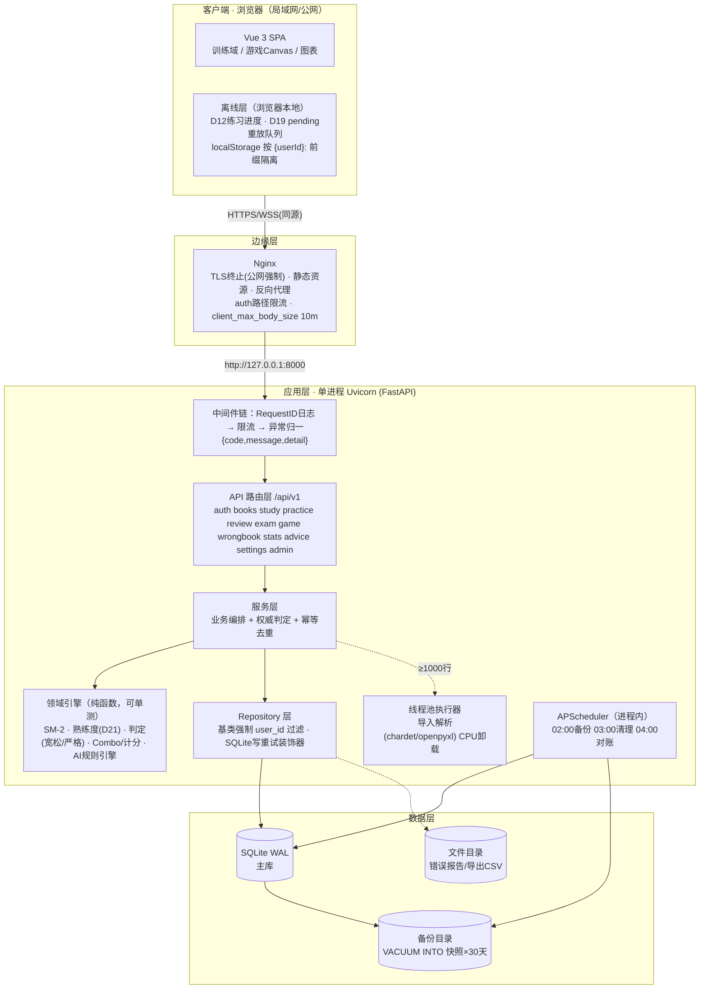
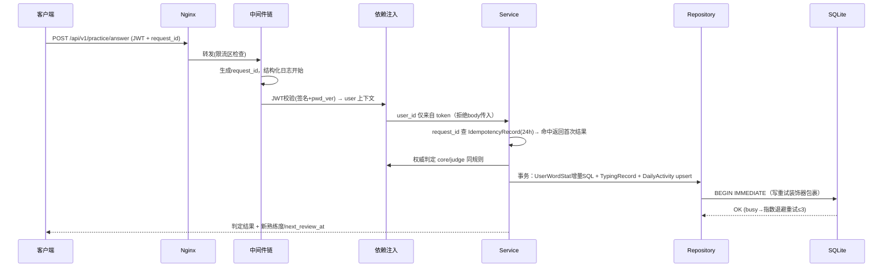
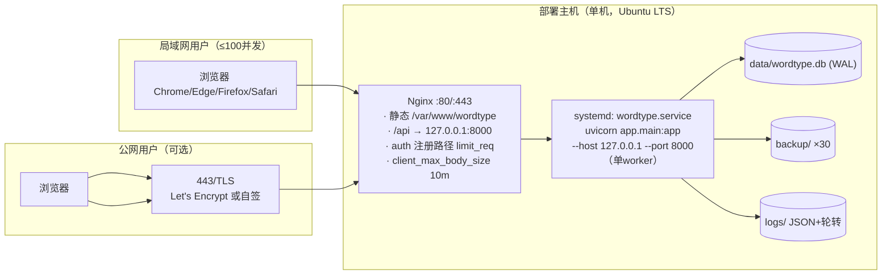
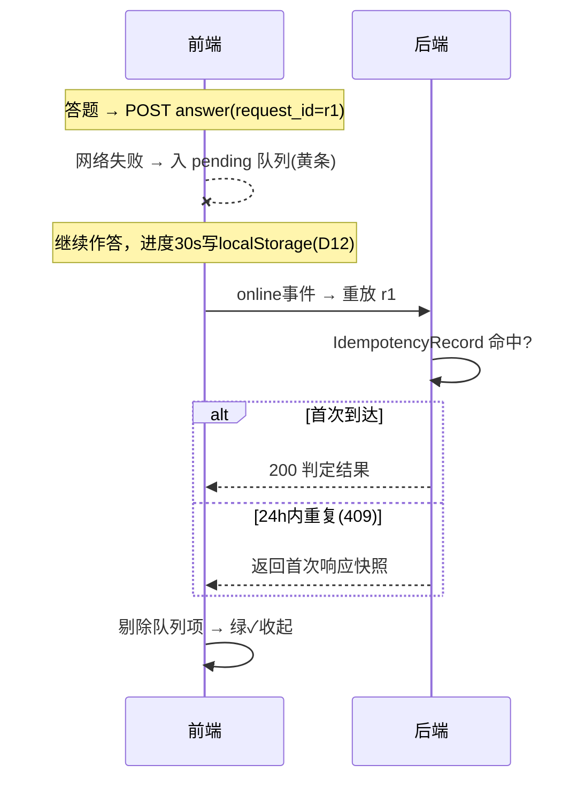
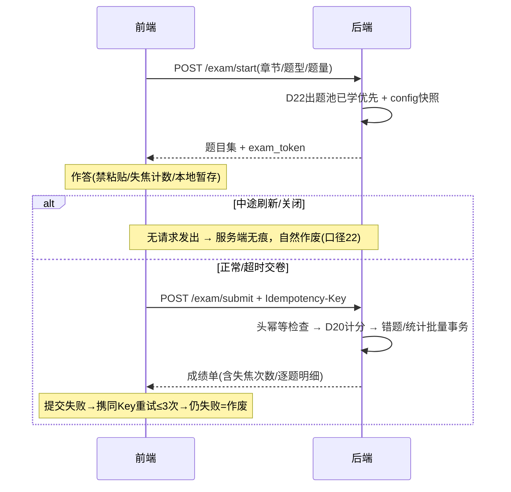
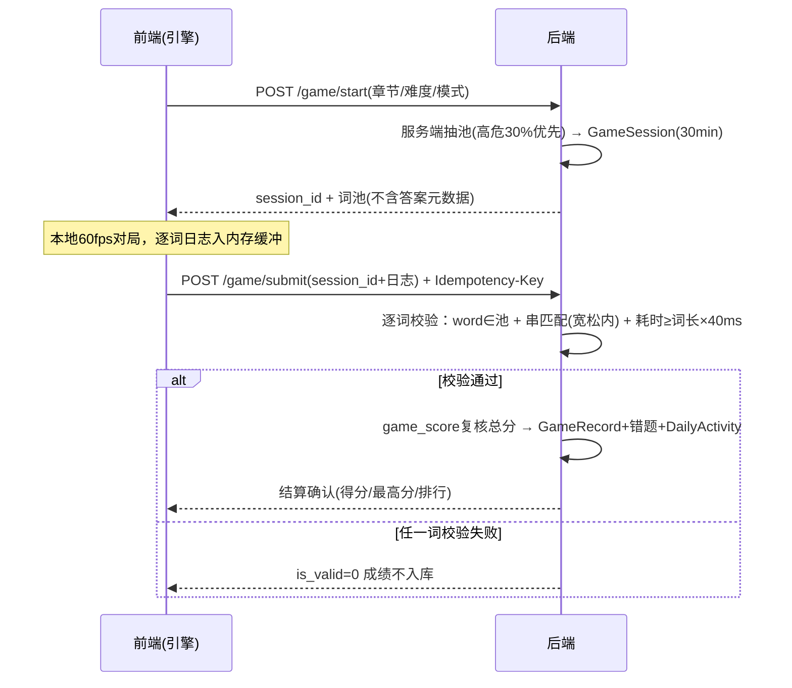

以下为**系统整体架构设计（AD v1.1）**，覆盖前端 / 后端 / 数据库 / 服务部署四层。全部结构对齐 v3.4 需求与 DS 视觉规范（D1–D33、SD1–SD18 均有架构落点，文末附追溯表）。v1.1 相对 v1.0：前端技术栈按实际落地校正为 Vue 3（v1.0 的 React 19 未采用）；AI 凭据改用户级（D29）+ 异步生成（D30）；游戏沉浸 UI（D31）；词库重分单元（D32）；全局深色模式（D33）；edge-tts 发音；管理端测试数据面板。含 4 张架构图、4 条关键时序、目录结构与环境配置，可直接作为开发骨架依据。
---
# 系统架构设计文档 v1.1
### WordType 打字背单词 · 配套《需求规格说明书 v3.4》
---
## 〇、架构总原则（先于结构）
| # | 原则 | 来源 |
|---|------|------|
| A1 | **单进程后端**：Uvicorn 1 个 worker，并发靠 asyncio；SQLite 单写者 + APScheduler 不重复调度，两者都约束单实例 | D3、五非功能 |
| A2 | **状态无服务端会话**：JWT 无状态鉴权，横向扩展预留（加实例零改造，仅幂等/限流需外移 Redis） | D2、D14 |
| A3 | **隔离下沉到 Repository 层**：业务代码禁止裸写 user_id 过滤 | 第九章 |
| A4 | **双端判定，服务端权威**：前端同算法预判定保证 0ms UX；计分一律以服务端结果为准 | 防作弊、D27 |
| A5 | **一切写操作幂等可重放**：头幂等（exam/game）+ body 幂等（单题 request_id）共用 Idempotency 中心 | D9、D19 |
| A6 | **时间只有服务器一个源头**：TZ 锁定环境变量，前端日期字段一律服务端下发 | D13 |
---
## 一、总体架构图

**拓扑要点**：Nginx 与应用同机部署（局域网）；公网时仅 Nginx 暴露 443，应用端口仅监听 127.0.0.1。前后端同源（Nginx 托管静态 + 反代 `/api`），无 CORS 负担，WebSocket 预留（本期用不到，轮询足够）。
---
## 二、前端架构
### 2.1 技术栈与选型记录
| 项 | 选型 | 理由 |
|----|------|------|
| 框架 | Vue 3 + **TypeScript**（v1.0 所写 React 19 未采用，按实际落地校正） | 判定引擎/游戏引擎/离线队列是重逻辑模块，需要类型约束；与后端 pydantic schema 可生成对齐 |
| 构建 | Vite | 事实标准；字体/分块/预加载配置直接支持 SD15 |
| 状态 | Pinia | 官方推荐；模块按域拆分 |
| 路由 | Vue Router 4，屏幕编号即路由命名（A1–M3） | 与原型/DS 规范一一对应 |
| HTTP | Axios 单实例 + 拦截器 | 统一 JWT、幂等键、401、重放挂点 |
| 图表 | ECharts（按需注册） | 需求锁定；仅仪表盘/成绩页动态 import |
| UI 组件 | Element Plus（v1.0 所写 shadcn/ui 未采用） | 表单/弹窗/表格等通用组件，自带深色模式 css-vars |
| 图标/字体 | Lucide-vue-next / JetBrains Mono 自托管 | SD5、SD15 |
### 2.2 分层与目录结构
```
src/
├─ main.ts / App.vue
├─ styles/tokens.css              ← SD 全量变量(light+dark)
├─ router/
│  ├─ index.ts                    ← 路由表（按屏幕编号）
│  └─ guards.ts                   ← 未登录重定向 B1；admin 路由 meta 鉴权
├─ stores/                        ← Pinia（全部按 userId 隔离读写）
│  ├─ auth.ts                     ← token/用户/滑动续期/pwd_ver 401 处理
│  ├─ settings.ts                 ← D26 设置缓存
│  ├─ quota.ts                    ← 今日额度(新词/复习) 全局共享
│  └─ practice.ts                 ← 当前组进度
├─ api/                           ← 按域模块化，全部经 http 实例
│  ├─ http.ts                     ← 拦截器：注入JWT/幂等头/request_id/401/新token捕获
│  └─ {auth,books,study,practice,review,exam,game,stats,advice,wrongbook,admin}.ts
├─ core/                          ← 框架无关纯逻辑（单测重点）
│  ├─ judge/                      ← 判定引擎：normalize + levenshtein（与后端同规则）
│  ├─ stats/                      ← WPM/准确率/逐字母延迟采集
│  ├─ offline/
│  │  ├─ pendingQueue.ts          ← D19：失败入队/重放/409剔除
│  │  ├─ practiceProgress.ts      ← D12：30s防抖写 localStorage
│  │  └─ storage.ts               ← {userId}: 前缀唯一入口（防裸用localStorage）
│  └─ idempotency.ts              ← uuid 生成与 key 管理
├─ composables/                   ← useTypingInput / useTTS / useCountdown / useTheme(D33) /
│                                    useServerDate(D13) / useTheme / useKeyboardShortcuts
├─ game/                          ← Canvas 引擎（不依赖 Vue，事件通信）
│  ├─ loop.ts                     ← 固定步长模拟 + rAF 渲染，60fps 预算
│  ├─ entities/                   ← Word/Drop/Particle
│  ├─ systems/                    ← 锁定系统(附录B优先级)/判定/Combo/血量/难度曲线
│  ├─ renderer.ts / particles.ts
│  └─ protocol.ts                 ← 与后端 submit 日志结构对齐
├─ components/{base,biz}/         ← DS v1.0 第三/四节组件清单
└─ views/                         ← auth/ dashboard/ library/ study/ practice/
                                   review/ exam/ game/ wrongbook/ settings/ admin/
```
### 2.3 前端关键机制
**① HTTP 拦截器契约**
| 拦截点 | 行为 |
|--------|------|
| 请求 | 注入 `Authorization`；exam/game submit 注入 `Idempotency-Key`（uuid，提交前生成并缓存直到成功）；单题请求体生成 `request_id` |
| 响应 2xx | 若 body 携带新 token（D14 滑动续期）→ 无感替换存储 |
| 401 | `code=AUTH_EXPIRED` → 跳 B1；`code=AUTH_PWD_CHANGED`（pwd_ver 失配，口径16）→ 提示「密码已变更，请重新登录」 |
| 网络错误 | 单题类（study/practice/review answer）→ 交由 PendingQueue；其余 toast 提示 |
**② D19 离线重放（与 DS 6.4 状态机一一对应）**
- 队列项：`{request_id, method, url, body, failedAt}`，存 `{userId}:pending`；
- 触发重放：`window online` 事件 + 页面获得焦点 + 每 30s 兜底；
- 服务端 409（request_id 已存在）→ 视为成功剔除（口径 24 返回首次结果，无需重算）；
- 重放期间该队列加互斥锁，防双标签页并发重放（Web Locks API）。
**③ 游戏引擎与 Vue 解耦**
- 引擎为纯 TS 模块，Vue 侧只传 `config(词池/难度/模式)` 与订阅 `onSettle/onProgress` 事件；
- 渲染 rAF 驱动，逻辑固定步长（16.6ms）保证不同刷新率下速度一致；
- 判定/Combo/加分（口径 19）全部本地实时执行，**逐词日志仅入缓冲数组**，结算时一次性提交；中途关闭 → 丢弃缓冲，不发请求（v3.1 附录 B 步骤 8）。
**④ 性能预算（训练页 60fps / P95 交互）**
| 项 | 预算 |
|----|------|
| 首屏 JS（gzip） | ≤ 250KB（ECharts/Game 路由级分包，不进首屏） |
| 字体 | 1 个 woff2 ≤ 100KB（SD15） |
| 击键→变色 | 0ms（同步 setState，无动画，DS 6.5 白名单） |
| 逐字格渲染 | 每词一次 DOM 更新批次（v-for + 状态 class，避免逐键 reflow） |
---
## 三、后端架构
### 3.1 分层与目录结构
```
app/
├─ main.py                    ← app工厂 + lifespan(启动scheduler/seed首个admin D15)
├─ core/
│  ├─ config.py               ← pydantic-settings，全部走环境变量
│  ├─ security.py             ← JWT签发/校验(含pwd_ver) · bcrypt · AES(D28 key加密)
│  ├─ errors.py               ← 统一异常 → {code,message,detail} + 语义化状态码
│  ├─ logging.py              ← 结构化JSON日志，ContextVar携带user_id/request_id
│  ├─ ratelimit.py            ← 登录(用户名+IP锁定10min) · 注册(IP 10/h)  ← 内存实现
│  └─ idempotency.py          ← Idempotency中心：头幂等依赖 + request_id去重(24h)
├─ db/
│  ├─ engine.py               ← async engine + PRAGMA(WAL/busy_timeout/foreign_keys)
│  ├─ session.py              ← 会话依赖
│  └─ retry.py                ← 写重试装饰器(指数退避×3)
├─ models/                    ← SQLAlchemy 模型（与第六章一一对应）
├─ schemas/                   ← pydantic 请求/响应（含分页/错误模型）
├─ repositories/
│  ├─ base.py                 ← IsolationBase：强制 user_id 过滤，禁裸查
│  └─ {user,word,stat,record,wrongbook,...}.py
├─ domain/                    ← 纯函数引擎（无IO，pytest 100%覆盖目标）
│  ├─ judge.py                ← 与前端 core/judge 同规则（trim/小写/lev≤1）
│  ├─ sm2.py                  ← SM-2 + D16映射 + D18回退 + D11重现标记
│  ├─ proficiency.py          ← D8/D21 增量计算(返回增量SQL参数)
│  ├─ exam_scoring.py         ← D20 每题1分/近似0.5
│  ├─ game_score.py           ← 口径19 Combo阶梯+高度加成（服务端复核用）
│  └─ advice.py               ← P3 规则引擎（口径20优先级）
├─ services/                  ← 业务编排：事务边界、幂等、DailyActivity实时upsert
│  └─ devdata_service.py      ← v3.3：管理端测试数据注入/清空（devdata）
├─ api/v1/                    ← 路由（与第七章 API 清单一一对应）
│  └─ deps.py                 ← get_current_user(JWT+pwd_ver) / require_admin / 幂等依赖
└─ tasks/
   ├─ scheduler.py            ← AsyncIOScheduler 单实例注册
   └─ jobs/ backup.py(02:00 VACUUM INTO+清理30天前) · cleanup.py(03:00注销30天物理清理+幂等键清理) · reconcile.py(04:00 DailyActivity对账)
```
### 3.2 中间件与请求生命周期

### 3.3 后端关键机制
| 机制 | 设计 |
|------|------|
| **判定双端同源** | `domain/judge.py` 与前端 `core/judge/` 规则逐字对齐（trim→lower→levenshtein≤1）；有共享测试向量 JSON，两端 CI 各跑一遍防漂移 |
| **熟练度并发安全（D2）** | 一律 `UPDATE user_word_stat SET proficiency=MIN(100,MAX(0,proficiency+:delta)), streak_correct=:s2 WHERE user_id=? AND word_id=?`——增量式，天然免读改写竞态 |
| **幂等中心（D9/D19/口径24）** | 头幂等：依赖读取 `Idempotency-Key` → `IdempotencyRecord` 查存（key+endpoint 唯一）；request_id 幂等：service 层入口查一次、事务内 INSERT OR IGNORE 兜底防并发穿透；响应快照存 24h |
| **登录锁定（模块1）** | 内存 LRU（`username+ip` → 失败计数/锁定到期），重启即清（可接受：锁定是防暴力而非审计）；不泄露锁定状态——错误文案统一 |
| **导入异步（模块2）** | ≤999 行同步解析；≥1000 行 `run_in_executor(ThreadPoolExecutor(max_workers=2))` → 写 ImportJob(parsed_json)；轮询接口只读。单机双 worker 上限，防并发导入挤占写连接 |
| **写重试（SQLite）** | `@write_retry` 装饰器：捕获 `OperationalError(database is locked)` → 0.1/0.2/0.4s 退避重试 3 次 → 仍失败 503 `DB_BUSY` |
| **定时任务单实例** | APScheduler 随 lifespan 启动；因 A1 单 worker，无重复调度问题（扩展多实例时迁移至独立 beat 进程，见 §六） |
| **AI 自定义模型（D28/D29/D30 v3.3）** | `services/llm_advice.py`：读用户自有凭据（UserAiConfig，key AES-GCM 解密），httpx 调 OpenAI 兼容端点；**异步生成**：首次立即返回规则占位（note="生成中"），后台 asyncio.create_task 覆盖缓存；失败自动重试 1 次后回落规则引擎，原因写入 advice_cache.note；admin 全局配置已删除，改用户级 /api/ai-config 三端点 |
---
## 四、数据库架构
### 4.1 SQLite 运行参数
```python
# db/engine.py 关键 PRAGMA（连接级，每次 checkout 执行）
PRAGMA journal_mode = WAL;        -- 读写不互斥
PRAGMA synchronous  = NORMAL;     -- WAL 下安全且快
PRAGMA busy_timeout = 5000;       -- ms，与写重试配合
PRAGMA foreign_keys = ON;
PRAGMA temp_store   = MEMORY;
```
| 策略 | 说明 |
|------|------|
| 连接池 | `pool_size=5, max_overflow=5`；WAL 允许多读并发，写由 `BEGIN IMMEDIATE` 序列化 |
| 事务边界 | Service 层控制：单题提交=1 事务（stat+record+daily 三表）；交卷=1 事务（exam record+错题+stat 批量）；杜绝跨请求长事务 |
| 写吞吐评估 | 100 用户峰值约 20 写/s（单题+日活 upsert），SQLite WAL 单写者实测数千/s，余量充足 |
### 4.2 表与索引
- 全量表结构、唯一约束、部分索引（`WHERE is_deleted=0` 等）**以 v3.1 第六章为准**，本节不重复；
- Alembic 管理迁移，迁移脚本必须包含索引同步创建；
- 软删过滤纪律：所有出题/列表查询经 Repository 基类拼接 `is_deleted=0`，代码评审 checklist 项。
### 4.3 容量与治理
| 表 | 增长估算（100 用户 × 1 年） | 治理 |
|----|---------------------------|------|
| TypingRecord | ~50 万–150 万行（主膨胀源） | detail_json 平均 1–2KB；P4 归档：>180 天按 user×月聚合成 LetterStat/月报后删除明细 |
| IdempotencyRecord | 24h 滚动，峰值数千行 | 03:00 清理（口径 24） |
| ImportJob | 过期 job + parsed_json 定期清 | 03:00 顺带清理 expires_at < now-24h |
| GameSession | 30 分钟生命周期 | 惰性失效（查询时判断）+ 03:00 清扫 |
### 4.4 备份与恢复
- 02:00 `VACUUM INTO 'backup/wordtype_YYYYMMDD.db'`（在线一致快照），保留 30 份；
- **恢复演练（v3.1 验收项）**：`restore` = 停应用 → 覆盖 db 文件 → 起应用 → 冒烟（登录/出题/统计三查），演练步骤写入运维手册；
- 备份失败告警：日志 ERROR + `/api/health` 附带 `last_backup_at` 字段。
### 4.5 PostgreSQL 迁移路径（P4 预留，不改动应用层）
| SQLite 现状 | PG 对应 | 改动点 |
|------------|---------|--------|
| `COLLATE NOCASE` 唯一索引 | `LOWER(spelling)` 函数唯一索引 | 仅 Alembic 迁移 |
| JSON 文本列 | JSONB | 模型类型切换 |
| 单文件 | 连接串 | engine.py |
| 头幂等/request_id | 不变（表结构通用） | 无 |
| APScheduler 内存锁 | 独立 beat 或 pg_cron | tasks/ 抽象 |
ORM 层写法全程规避 SQLite 方言函数（如 `strftime`），保证迁移只动配置与个别索引。
---
## 五、服务部署架构
### 5.1 部署拓扑

### 5.2 环境变量（.env，部署必填）
| 变量 | 说明 | 约束 |
|------|------|------|
| `TZ=Asia/Shanghai` | **D13 全局切日物理基础** | 容器/服务/systemd 三处一致 |
| `JWT_SECRET` | 签名密钥 | ≥32 字符随机 |
| `AES_KEY` | D28 API Key 加密密钥 | 32 字节，与 JWT_SECRET 分离 |
| `ADMIN_USERNAME` / `ADMIN_PASSWORD` | D15 首个 admin 种子 | 首次启动创建后置空 |
| `INVITE_REQUIRED` | 公网邀请码开关（D25） | 默认 false |
| `PUBLIC_DEPLOY` | 公网模式：启用排行榜/HTTPS 提示/邀请码 | 默认 false |
| `DAILY_BACKUP_DIR` / `LOG_LEVEL` | 备份目录 / 日志级别 | — |
### 5.3 Nginx 关键配置（节选）
```nginx
server {
    listen 443 ssl;
    ssl_certificate     /etc/nginx/certs/fullchain.pem;
    ssl_certificate_key /etc/nginx/certs/privkey.pem;
    gzip on; gzip_types application/javascript text/css application/json;
    client_max_body_size 10m;                    # 对齐上传上限
    location /assets/ { root /var/www/wordtype; expires 30d; immutable; }
    location = /fonts/JetBrainsMono-Variable-latin.woff2 {
        root /var/www/wordtype; expires 365d; add_header Cache-Control "public, immutable";
    }
    location /api/ {
        proxy_pass http://127.0.0.1:8000;
        proxy_set_header X-Real-IP $remote_addr;  # 限流依赖
        proxy_read_timeout 60s;
    }
    location ~ ^/api/(auth/(login|register)) {
        limit_req zone=auth burst=10 nodelay;     # 与应用内限流双保险
        proxy_pass http://127.0.0.1:8000;
        proxy_set_header X-Real-IP $remote_addr;
    }
    location / { root /var/www/wordtype; try_files $uri /index.html; }
}
```
### 5.4 进程守护与日志
- **systemd 单元**：`Restart=always`、`ExecStart=uvicorn app.main:app --host 127.0.0.1 --port 8000 --workers 1`（**workers 必须=1**，理由 A1）；
- 日志：应用输出 JSON 到 stdout → systemd → 文件轮转（logrotate 每日，保留 14 天）；慢查询：Repository 层 >200ms 记 WARN；
- 健康检查：`GET /api/health`（无鉴权）返回 `{db, last_backup_at, scheduler_alive}`，可接 Uptime Kuma 等轻监控。
### 5.5 公网加固清单（PUBLIC_DEPLOY=true 时）
| 项 | 措施 |
|----|------|
| 传输 | 强制 HTTPS，HTTP 301 跳转；HSTS |
| 注册 | 邀请码必填（D25）+ IP 限流 10/h（应用内）+ Nginx limit_req |
| 备份 | 增加异地/对象存储副本（rclone 每日推送，02:30） |
| 密钥 | `.env` 权限 600；JWT_SECRET 上线后不轮换（轮换需全量重登，纳入变更流程） |
| 排行榜 | 开启（按 difficulty×mode 分组） |
### 5.6 扩展路线（预留，不预建）
```
阶段0（当前）：单机单进程 + SQLite —— 满足 ≤100 并发（D3）
阶段1：用户/数据量增长 → 换 PostgreSQL（§4.5），应用代码零改动
阶段2：多实例 → SQLite→PG 已解；需外移两件套：
        限流/锁定计数 + IdempotencyRecord → Redis；
        APScheduler 拆独立 beat 进程（或 pg_cron）
阶段3：静态资源上 CDN；TypingRecord 冷热分离
```
---
## 六、关键链路时序（3 条）
### 6.1 断网重放（D19 全链路）

### 6.2 考核交卷（D9 批量 + 头幂等 + 中断作废）

### 6.3 游戏开局—结算（D27 防作弊）

---
## 七、需求 → 架构追溯表（核心项）
| 需求 | 架构落点 |
|------|---------|
| D2 多设备/增量熟练度 | §3.3 增量 UPDATE SQL；服务端为唯一事实源 |
| D8/D16/D17/D21 | `domain/sm2.py + proficiency.py` 纯函数引擎，单测覆盖 |
| D9/D19/口径24 | `core/idempotency.py` 中心 + 前端 PendingQueue（§2.3②） |
| D12 断点续练 | 前端 `offline/practiceProgress.ts`，30s 防抖 |
| D13 切日 | `TZ` 环境变量 + `useServerDate` + 后端 date 字段下发 |
| D14 滑动续期/pwd_ver | 拦截器契约（§2.3①）+ `core/security.py` |
| D15 首个 admin | lifespan 种子任务（§3.1 main.py） |
| D19 重放 | §6.1 时序 |
| D20/D22 考核 | `domain/exam_scoring.py` + config_json 快照（§6.2） |
| D25 邀请码 | InviteCode 表 + `/api/admin/invite-codes` + 注册依赖校验 |
| D27 游戏词池 | GameSession 表 + 服务端抽池（§6.3） |
| D28/D29 自定义模型 | v3.3：`services/llm_advice.py` + 用户自有凭据 UserAiConfig + AES-GCM + 失败回落 + note 回退原因 |
| D30 异步建议 | v3.3：asyncio.create_task 后台生成，前端 4s 轮询；首次立即返回规则占位不阻塞页面 |
| D31 游戏沉浸 UI | v3.3：对局全屏深色沉浸 + 导航上收 + 一体化 HUD + 暂停面板 + 按键音效（game_key_sound）+ 开局必选词库 |
| D32 词库重分单元 | v3.3：resplit 双模式 + 清空章节保留单词 + 公开库非 owner 403 |
| D33 全局深色模式 | v3.4：html.dark 类 + --wt-* CSS 变量 + Element Plus dark css-vars；localStorage wt-theme；顶栏三态切换按钮 |
| 隔离（第九章） | `repositories/base.py` IsolationBase 强制过滤 |
| 非功能 60fps/P95 | §2.3④ 前端预算 + A1 单进程异步 |
| 备份/定时任务 | `tasks/jobs` 三任务 + 恢复演练 runbook |
---
## 八、架构决策记录（ADR 摘要）
| # | 决策 | 备选 | 理由 |
|---|------|------|------|
| ADR-1 | 单进程 Uvicorn | 多 worker | SQLite 单写者 + APScheduler 防重复调度；asyncio 足够 100 并发；扩展时按 §5.6 演进 |
| ADR-2 | 前端 TypeScript | JS | 判定/游戏/离线队列重逻辑；双端 schema 对齐 |
| ADR-3 | 判定双端同源、服务端权威 | 仅前端判定 | 防作弊（P2 验收②）；保证统计口径唯一 |
| ADR-4 | 幂等集中式（表+依赖） | 各 service 自查 | 头幂等与 request_id 统一治理，24h 过期一处清理 |
| ADR-5 | 游戏引擎独立于 Vue | Vue 响应式驱动 | rAF 与响应式调度冲突；性能与可测性 |
| ADR-6 | 限流/锁定内存实现 | Redis | 单机部署最小依赖；扩展阶段外移（§5.6） |
---
**收尾**：架构 v1.1 与 v3.4 全部决策闭环（D1–D33），无未落点项。v1.0 的 React 19 技术栈已按实际落地校正为 Vue 3 + Element Plus。下一步可选：① 输出 **OpenAPI 骨架**（schemas + 路由签名，直接可跑）；② 输出 **pytest 判定同源测试向量**（双端共享 JSON，防规则漂移）；③ 输出 **systemd + Nginx + logrotate 完整部署包**（一条脚本完成初始化）。
