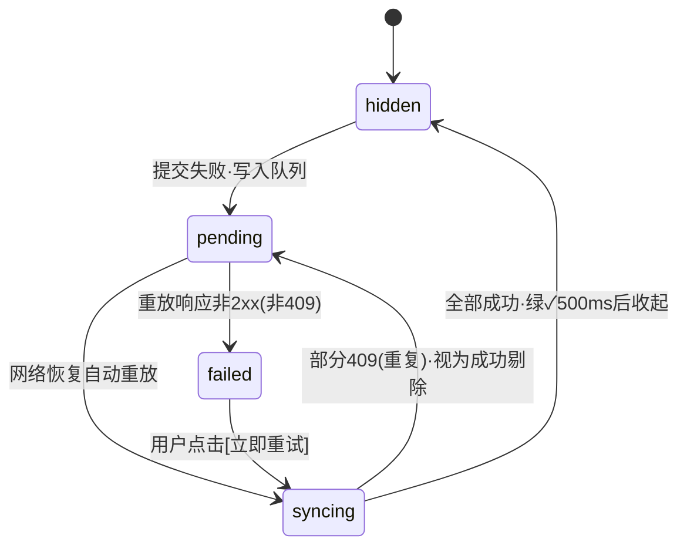

以下为配套 v3.1 定稿的**高保真 UI 设计与交互规范（DS v1.0）**。所有视觉值（色板/字号/间距/动效曲线）均为可执行精度，可直接建 Figma Variables 或拷入前端 `tokens.css`；屏幕编号沿用低保真原型（A1/B1/C1…），保证追溯。文中标注方式：△ = 该色仅用于大字号/图形（AA 不达标），其余均通过 WCAG AA。
---
# 高保真 UI 设计与交互规范 v1.0
### 配套《需求规格说明书 v3.1》 · WordType 打字背单词
---
## 一、设计原则（先于一切像素）
| # | 原则 | 落地约束 |
|---|------|---------|
| 1 | **反馈快于思考** | 判定结果与击键**同步**呈现（0ms 直变色，不加入场动画）；任何操作反馈 ≤100ms 可感知 |
| 2 | **心流零打断** | 答题页无广告位、无跳转链接；打断类信息一律用非阻断 Toast/提示条；快捷键覆盖全部高频操作 |
| 3 | **激励可视化** | 连续天数/连击/热力图使用「成长感」色彩梯度与微动效；成就时刻允许 Overshoot 弹性动效 |
| 4 | **认知减负** | 一屏一任务；数字一律 `tabular-nums`；**判定不允许仅靠颜色区分**（必须图标 + 文案冗余，防色盲） |
设计关键词：**专注蓝 · 成长绿 · 即时反馈 · 克制的游戏感**
---
## 二、Design Tokens 设计变量
### 2.1 色彩系统
**① 品牌色 Brand（主操作 / 链接 / 选中态）**
| Token | 值 | 用途 | 对比度 |
|-------|-----|------|--------|
| brand-50 | #EEF4FF | 悬浮底、导航选中底 | — |
| brand-100 | #D9E6FF | 选中背景、进度条底 | — |
| brand-300 | #8FB1FA | 图表辅助 | — |
| brand-400 | #6C93FF | **暗色模式主色** | — |
| brand-500 | #4E7CF6 | 主按钮底、进度填充、下一键高亮 | 白字 3.9:1 △（限 ≥16px 粗体/按钮） |
| brand-600 | #3B66E0 | 主按钮 hover | 白字 4.6:1 ✓ |
| brand-700 | #2F52C4 | 文字链接、正文中的强调色、active | 白底 6.5:1 ✓ |
| accent-500 | #FF9F43 | 游戏强调：连击火焰、奖励、新纪录 | △ 图形专用 |
| accent-600 | #F5871F | accent hover / 深火焰 | △ |
**② 中性色 Neutral**
| Token | 值 | 用途 | 对比度 |
|-------|-----|------|--------|
| bg-page | #F6F7FA | 页面底 | — |
| bg-container | #FFFFFF | 卡片/面板底 | — |
| bg-hover | #F2F4F8 | 行 hover、次按钮 hover | — |
| border-1 | #EDF0F4 | 卡片描边、分隔线 | — |
| border-2 | #D9DCE1 | 输入框描边 | — |
| text-1 | #1F2329 | 主文本 | 15.3:1 ✓ |
| text-2 | #5C6470 | 次文本、说明 | 6.9:1 ✓ |
| text-3 | #717A85 | 辅助说明、状态栏 | 5.0:1 ✓ |
| text-disabled | #B8BDC7 | 禁用 | 仅禁用态 |
**③ 判定三色 Judgment（产品灵魂，全端唯一口径）**
| 状态 | Token 组 | fg（文字/图标） | bg（底） | border | 图标 | 文案口径 |
|------|---------|------|------|--------|------|---------|
| ✓ 完全正确 | ok | #389E0D | #F2FBEC | #B7EB8F | `✓` | 按答对处理 |
| ≈ 近似 | near | #D48806 | #FFF8E6 | #FFE58F | `≈` | 按答错计熟练度，不重置复习计划 |
| ✗ 错误 | err | #CF1322 | #FFF1F0 | #FFA39E | `✗` | 按答错处理 |
> **色盲冗余铁律**：三态必须同时呈现 图标形状（✓/≈/✗）+ 文案标签，颜色仅为辅助；练习结果页逐词列表同样按此三组配色。
**④ 虚拟键盘指法八区**（bg 为键帽底色，bd 为键帽下边 3px）
| 区 | bg | bd | 覆盖键 |
|----|-----|-----|--------|
| 左小指 | #FFE3E3 | #FA5A5A | Q A Z ` 1 |
| 左无名指 | #FFE8D9 | #FA8C16 | W S X 2 |
| 左中指 | #FFF7D6 | #D4A017 | E D C 3 |
| 左食指 | #DFF7E3 | #38A169 | R F V T G B 4 5 |
| 右食指 | #D9F0FF | #2B8CD9 | Y H N U J M 6 7 |
| 右中指 | #DCEBFF | #4E7CF6 | I K , 8 |
| 右无名指 | #E8E0FF | #7C5CFC | O L . 9 |
| 右小指 | #FFE0F0 | #E0449E | P ; / 0 - = [ ] |
补充：**基准键位**（A S D F / J K L ;）键帽中心加 4px 色点（bd 同色）；**下一键高亮**= 键帽填充 brand-500 + 白字 + 外圈呼吸光环（见 6.4）；**按压态** = scale(0.96) + 加深 80ms。
**⑤ 热力图色阶**
| 图表 | 阶梯 |
|------|------|
| 打卡日历（5 档） | L0 #EEF1F6 → L1 #BDD3FB → L2 #7FA8F8 → L3 #4E7CF6 → L4 #2F52C4 |
| 逐字母延迟（5 档，分位数） | 快 #52C41A → #A0D911 → #FAAD14 → #FA8C16 → 慢 #F5222D |
| 熟练度分布 | 已掌握 #52C41A / 巩固中 #4E7CF6 / 高危 #FAAD14（三图统一） |
**⑥ 游戏画布专用（恒定暗色，不随主题切换）**
| 元素 | 值 |
|------|-----|
| 画布底 | 线性渐变 #14171B → #1B2026（上→下） |
| 未敲字符 | rgba(255,255,255,0.85)，mono 20–24px |
| 已敲正确字符 | #52C41A 加粗 |
| 已敲错误字符 | #FF4D4F（附带抖动） |
| 锁定词光环 | #FFD666（虚线环 → 实线环） |
| 落地警戒线 | rgba(255,77,79,0.5) 2px dashed |
| 血量 | #FF4D4F；Combo 火焰渐变 #FF9F43→#FF4D4F |
**⑦ CSS Variables（可直接拷贝）**
```css
:root {
  --brand-50:#EEF4FF; --brand-100:#D9E6FF; --brand-300:#8FB1FA;
  --brand-400:#6C93FF; --brand-500:#4E7CF6; --brand-600:#3B66E0; --brand-700:#2F52C4;
  --accent-500:#FF9F43; --accent-600:#F5871F;
  --bg-page:#F6F7FA; --bg-container:#FFF; --bg-hover:#F2F4F8;
  --border-1:#EDF0F4; --border-2:#D9DCE1;
  --text-1:#1F2329; --text-2:#5C6470; --text-3:#717A85; --text-disabled:#B8BDC7;
  --ok-fg:#389E0D; --ok-bg:#F2FBEC; --ok-bd:#B7EB8F;
  --near-fg:#D48806; --near-bg:#FFF8E6; --near-bd:#FFE58F;
  --err-fg:#CF1322; --err-bg:#FFF1F0; --err-bd:#FFA39E;
  --ring:0 0 0 3px rgba(78,124,246,.28);
  --shadow-1:0 1px 2px rgba(31,35,41,.06);
  --shadow-2:0 4px 12px rgba(31,35,41,.08);
  --shadow-3:0 12px 32px rgba(31,35,41,.12);
  --r-sm:6px; --r-md:8px; --r-lg:12px; --r-xl:16px; --r-full:999px;
  --dur-1:120ms; --dur-2:200ms; --dur-3:300ms;
  --ease-standard:cubic-bezier(.2,0,0,1);
  --ease-out:cubic-bezier(0,0,.2,1);
  --ease-spring:cubic-bezier(.34,1.56,.64,1);
  --font-ui:-apple-system,BlinkMacSystemFont,"Segoe UI","PingFang SC","Hiragino Sans GB","Microsoft YaHei","Noto Sans SC",sans-serif;
  --font-mono:"JetBrains Mono","Cascadia Code","SF Mono",Consolas,"Roboto Mono",monospace;
}
```
### 2.2 字体系统
| 用途 | 字体栈 |
|------|--------|
| UI 界面 | `--font-ui`（系统栈，中文优先 PingFang/微软雅黑） |
| **英文单词展示 + 打字输入（全部场景）** | `--font-mono` —— 等宽保证逐字格对齐 |
| 数字（统计/成绩/排行） | UI 栈 + `font-variant-numeric: tabular-nums`（强制） |
字阶（px/行高/字重）：
| Token | 值 | 用途 |
|-------|-----|------|
| display | 40/48/700 | 游戏得分、考核总分 |
| word-xl | 36/44/600 mono | 学习卡单词 |
| word | 24/32/600 mono | 打字逐字格 |
| h1 | 24/32/600 | 页面标题 |
| h2 | 20/28/600 | 卡片标题 |
| h3 | 16/24/600 | 区块标题、按钮大字 |
| body | 14/22/400 | 默认正文 |
| caption | 13/20/400 | 次要说明、状态栏 |
| mini | 12/18/400 | 角标、标签 |
### 2.3 布局 / 圆角 / 阴影 / 层级
- **栅格**：内容区 max-width 1200px 居中，12 列，gutter 24px；仪表盘卡片间距 16px。
- **断点**：≥1440 宽屏（仪表盘 3 列）｜1024–1439 标准｜768–1023 侧栏收窄为 56px 图标栏｜<768 底部五宫格 Tab（仪表盘/学习/复习/游戏/更多）。
- **圆角**：按钮/输入 8 ｜ 卡片 12 ｜ 弹窗 16 ｜ 标签 999 ｜ 逐字格 6。
- **阴影**：卡片静止 shadow-1；hover/下拉 shadow-2；弹窗 shadow-3。
- **z-index**：内容 0 → 吸顶 100 → 下拉 1000 → 抽屉 1100 → 弹窗 1200 → Toast 1300 → Tooltip 1400。
### 2.4 动效 Token
| Token | 值 | 用途 |
|-------|-----|------|
| dur-1 | 120ms | hover、按压 |
| dur-2 | 200ms | 状态切换、卡片平移 |
| dur-3 | 300ms | 弹窗、路由过渡 |
| ease-standard | (0.2, 0, 0, 1) | 通用 |
| ease-out | (0, 0, 0.2, 1) | 入场 |
| ease-spring | (0.34, 1.56, 0.64, 1) | 成就/升级/销毁（允许 Overshoot） |
---
## 三、通用组件规范（速查）
> 每个组件给出：尺寸 → 变体 → 状态 → 焦点。未列出的默认取 Token。
**Button**
- 尺寸：lg 48 / md 40 / sm 32；内边距 24/16/12；圆角 8；字号 16/14/13。
- 变体：Primary（brand-500 底白字，hover 600，active 700）｜Secondary（白底 border-2 + text-1，hover bg-hover）｜Ghost（无底，字 brand-700，hover brand-50）｜Danger（#F5222D 底白字）｜Text。
- 状态：disabled = bg #EDF0F4 + 字 #B8BDC7（全部变体）；loading = 左侧 14px spinner，文案不变，禁点不置灰遮罩。
- 焦点：`box-shadow: var(--ring)`；键盘 Enter/Space 触发。
**Input**
- 高 40（lg 48）；描边 border-2，focus = border brand-500 + ring；error = border #F5222D + 下方 12px caption 红字 + 图标。
- 只读/禁用底 #F7F8FA。注册页用户名实时校验提示（合法 ✓ 绿 / 超长 ✗ 红）。
**Checkbox / Radio / Switch / Slider / Stepper**（设置页 K1 全量使用）
- 选中即 brand-500；Switch 36×20，开启 brand-500，关闭 #D9DCE1；Slider 轨道 4px，已选段 brand-500；Stepper（考核题量）± 按钮 32×32。
- 所有控件有 hover + focus ring；label 点击同效。
**Card**：白底 / border-1 / r-12 / shadow-1 / 内边距 20；可点击卡片 hover = shadow-2 + translateY(-2px) 200ms。
**Dialog**：尺寸 sm 400 / md 560 / lg 720；遮罩 rgba(20,23,27,0.45) + backdrop-blur(2px)；入场 scale 0.96→1 + 淡入 200ms ease-out；Esc 关闭；打开时焦点移入第一个可交互元素，关闭归还触发元素。
**Toast**：顶部居中（TopBar 下方 72px），max-w 480，类型复用判定三色 + info；默认 3s 自动消失，可含一个动作按钮；同屏最多叠 3 条。
**Tabs**：下划线式，选中 2px brand-500 + 字 brand-700；词库详情章节 Tab 支持下拉溢出（«更多»）。
**Table**（词库/错题/用户列表）：表头 44px 底 #F7F8FA 字 text-2；行高 48，hover bg-hover；5000+ 行虚拟滚动；排序点击表头出 ↑↓。
**Pagination**：`‹ 1 2 3 … 85 ›`，当前页 brand-500 底白字圆角 8；页容量选择器默认 50。
**Progress**：条形高 8 r-full（额度条/练习进度条）；环形用于考核倒计时旁。额度 ≥90% 段变 accent-500 预警。
**Empty**：插画（线性风格，stroke 1.5，brand-100 主调）+ 一句主文案 + 一个 Ghost 按钮（如「去学习」）。
**Skeleton**：色 #EEF1F6 / #E3E7ED 交替 shimmer 1.2s；加载 >300ms 才出现，避免闪烁。
---
## 四、业务组件规范（打字产品专属）
### 4.1 JudgeFeedback 判定反馈（复用度最高）
- 结构：`图标(20px) + 标签(h3) + 副文案(caption)`，整体 chip 化（r-8，bg/border 按 2.1③）。
- 时序：**颜色与图标 0ms 直变（无动画）** → 图标 pop（scale 0.6→1，180ms ease-spring）→ 副文案淡入 120ms → 停留 1000ms 自动进下一题（默写卡）/ 即时进下一词（游戏）。
- 近似态必须带解释性副文案：「只差一个字母！计入错误，但不打乱复习节奏」。
### 4.2 TypingInput 打字逐字格
- 逐字格：44×44（响应式缩放 ≥32），r-6，mono 24/600。
- 字符四态：`pending`（底 #F7F8FA，字 #B8BDC7）｜`correct`（字 ok-fg，无底）｜`error`（字 err-fg + 一次性抖动）｜`caret`（2px brand-500 竖线，呼吸 opacity 1↔0.3，1s infinite）。
- **抖动规范**：translateX ±4px 3 个来回共 240ms，**每词仅触发一次**，连续错误不重复播放（防闪烁）；`prefers-reduced-motion` 时只变色不抖动。
- IME 态：composition 期间字符显示下划线并暂停判定，顶部提示「请切换至英文输入模式」。
- 退格：删除即回到 pending 态，**不闪红**（附录 B 口径：退格不扣血不断 Combo）。
### 4.3 VKeyboard 虚拟键盘
- 键帽 44×44 gap 6，指法八区配色见 2.1④；手指分区图例为可开关浮层（「指法引导」设置项）。
- 下一键高亮：键帽填 brand-500 + 白字 + 外圈呼吸环（box-shadow 0 0 0 0 → 0 0 0 8px 透明，1.2s infinite）。
- 关闭指法引导时：整盘灰白，仅保留下一键高亮。
### 4.4 其余业务组件
| 组件 | 规格 |
|------|------|
| QuotaBar 额度条 | 高 8，填充 brand-500；≥90% 换 accent-500；右侧「12/20」mono caption；满额禁用 + 弹 P1-1 |
| StreakFlame 连续天数 | 🔥 三级：3–6 天橙 / 7–29 天橙+光晕 / ≥30 金紫渐变；火焰摇曳 rotate ±4° 2s infinite（reduced-motion 关闭） |
| CalendarHeatmap | 12 周 × 7 格 12×12 gap 3 r-2；tooltip = 日期 + 新学/复习/对错计数；**当日提交后格子即时点亮**（scale 0.8→1，250ms spring，口径 21 的 UI 落点） |
| OfflineSyncBar 离线同步条（D19） | 答题页顶部通栏 32px：pending（旋转图标 +「N 条待同步」黄底）→ syncing → done（✓ 绿，500ms 自动收起）→ failed（红底 + [立即重试]） |
| ExamTimer 考核倒计时 | mono 20 tabular；<60s 变 #F5222D + opacity 1↔0.6 闪烁 1s infinite；到时输入锁定 + 遮罩「时间到，正在交卷…」 |
| BloodBar 血条 | 5 颗心 20px；失血动画：scale 1→1.3 + rotate 15° → 淡出 300ms，同时整条横向抖动一次 |
| ComboBadge 连击徽章 | 右上角 chip「连击 7 ×1.5」；升档瞬间 scale 1→1.25→1（300ms spring）+ 一次径向光晕；退格不影响显示，清零时灰化 200ms |
| LetterHeatmap 字母热力 | 两形态：26 键位着色版（复用键盘布局）/ Top5 列表版（条形 + 延迟 ms） |
| ServerDateChip 服务器日期 | caption + ℹ️ hover：「按服务器时区（UTC+8）计算“一天”」——D13 的 UI 兜底解释 |
---
## 五、页面级高保真规范
> 4 张关键屏给出完整标注稿，其余屏幕以「差异点表」给出（组件与全局规范一致）。
### 5.1 C1 仪表盘（完整标注）
```
┌──────────────────────────────────────────────────────────────────────┐
│ ◆ WordType  [🔍 搜索 ⌘K]                          🔔   张三▾          │ TopBar 56px 白底 border-1
├─────────┬────────────────────────────────────────────────────────────┤
│ 侧栏     │  仪表盘                     [服务器日期 2026-09-04 ℹ️] ⑦    │ h1 + ServerDateChip
│ (图1规范) │  ┌ AI 今日建议 ────────────────────────────────────────┐ ① │ 建议卡: bg brand-50
│          │  │ 💡 错误率>60%的词 12 个      [立即专项练习 md]        │   │ r-12 shadow-1
│          │  │ 💡 高危词明日到期 8 个       [现在复习 md]            │   │ 每行: 图标+h3+右侧按钮
│          │  │ 💡 指法预警 "th/ion" 最慢    [指法专项 md]            │   │
│          │  │                     [↻ 刷新 · 今日 1/3] ②            │   │ Ghost sm
│          │  └─────────────────────────────────────────────────────┘   │
│          │  ┌ 23 ──┐┌ 12/20 ┐┌ 7天🔥 ┐┌ 45 ──┐ ③                    │ 统计卡4列: 数字32/700
│          │  │待复习 ││今日新学││连续天数││本周WPM│                    │ tabular + 点线趋势箭头
│          │  └──────┘└───────┘└───────┘└──────┘                       │
│          │  ┌ 打卡热力图 · 连续7天🔥 ──┐ ┌ 熟练度分布 ───────┐ ④⑤     │
│          │  │ 一 ▢▢▩▦▦▢▦▦▦▢▦▦        │ │  ◔ 已掌握 34%     │         │ 环图三色见2.1⑤
│          │  │ …                       │ │  ◑ 巩固中 41%     │         │ 当日格点亮动画
│          │  └─────────────────────────┘ └───────────────────┘        │
│          │  ┌ WPM/准确率趋势 [练习|复习|考核|全部 ▾] ┐ ┌ 未来7天复习量 ┐ ⑥ │
│          │  └──────────────────────────────────────┘ └──────────────┘ │
├─────────┴────────────────────────────────────────────────────────────┤
│ 状态栏32px: 服务器日期 2026-09-04 │ 额度: 新词 12/20 · 复习 30/100 ⑧  │ bg #FAFBFC caption
└──────────────────────────────────────────────────────────────────────┘
```
**标注**：① 建议卡按口径 20 固定优先级取 3 条，按钮直跳对应模式并携带范围参数；② 手动刷新计数（D28）；③ 统计卡整卡可点（待复习→H1，新学→E1）；④ 热力图 DailyActivity 实时点亮；⑤ 环图 hover 出数值 tooltip；⑥ 趋势图按 TypingRecord.source 筛选，线条 brand-500，准确率虚线 accent-500；⑦ D13 日期兜底解释；⑧ 额度 chips，满额变 accent。
### 5.2 E2/E3 学习卡片（合并状态稿）
```
【态 A · 自评卡】                【态 B · 默写卡-展示 3s】      【态 C · 默写卡-输入】
┌──────────────────────┐    ┌──────────────────────┐    ┌──────────────────────┐
│ 14/40   U3高频    🔊 │    │ ◔◔◔ 3s   [跳过 ▸]    │    │ 释义: v. 放弃；遗弃    │
│                      │    │                      │    │ 例句: They ________   │
│      abandon         │    │      abandon         │    │                      │
│    /əˈbændən/        │    │    /əˈbændən/  ← blur│    │ a b a n d o n █      │
│    v. 放弃；遗弃      │    │      v. 放弃          │    │ (逐字格+caret)        │
│  They abandoned...   │    └──────────────────────┘    │                      │
│                      │    3s 进度点右→左消失 250ms/个  │ [✓完全正确·3天后见]   │
│ [✗不认识][？模糊][✓认识]│    跳过: 立即进态C            │ [≈接近了·明天复习]     │
│  (brand-100描边卡)     │                               │ [✗差一点·稍后重现 1/2] │
│  快捷键 1 / 2 / 3     │                               └──────────────────────┘
└──────────────────────┘                                 判定chips按2.1③配色
```
**关键交互**：态 B→C 过渡 = 单词区 blur(4px)+fade 200ms 后隐藏、输入区 slide-up 200ms 并**自动聚焦**；展示期不计 WPM（口径 13）；三键按下 0ms 高亮 + 卡片左滑出、新卡右滑入（200ms ease-standard）；「不认识」角标「稍后重现 n/2」（D8/当轮重刷）；结果 chip 停留 1000ms 自动下一词。
### 5.3 F2 打字练习页（完整标注）
```
┌──────────────────────────────────────────────────────────────────────┐
│ ⬆ 2 条记录待同步…已自动重放 ✓                    ← OfflineSyncBar(D19)│ 仅断网时出现
├──────────────────────────────────────────────────────────────────────┤
│ 练习 5/20 ████████░░░░░░   WPM 42│准确率96%│ [✕ 结束组]  ①           │ 顶栏48px sticky
│                                                                      │
│                v. 放弃；遗弃      ②                                  │ h2 text-1 居中
│                                                                      │
│            ┌─┬─┬─┬─┬─┬─┬─┬─┬─┬─┐                                    │
│            │a│b│a│n│d│ │ │ │ │ │    ③                             │ 逐字格 4.2 规范
│            └─┴─┴─┴─┴─┴─┴─┴─┴─┴─┘                                    │
│                                                                      │
│  ┌───┬───┬───┬───┬───┬───┬───┬───┬───┬───┐                           │
│  │ Q │ W │ E │ R │ T │ Y │ U │ I │ O │ P │ ④                        │ 指法八区色
│  ├───┼───┼───┼───┼───┼───┼───┼───┼───┼───┤   下一键 = R(高亮)       │ brand-500+呼吸环
│  │ A │ S │ D │ F │ G │ H │ J │ K │ L │   │                           │
│  └───┴───┴───┴───┴───┴───┴───┴───┴───┴───┘                           │
│                                                                      │
│  [≈ 接近了！只差一个字母，计入错误但不打乱复习节奏]  ⑤                  │ 判定chip(near)
└──────────────────────────────────────────────────────────────────────┘
```
**标注**：① WPM/准确率 mono tabular 每 2s 刷新；「结束组」= Ghost + Esc 快捷，弹 P1-2；② 题面随题型切换（默写/选择/听音🔊/挖空）；③ 进入自动聚焦，IME 态提示见 4.2；④ 指法引导开关实时生效；⑤ 判定 chip 位置固定不跳动（防布局位移）。
### 5.4 J2 游戏对局（完整标注）
```
┌──────────────────────────────────────────────────────────────────────┐
│ ❤❤❤❤❤      得分 1,280(display mono)      连击7 ×1.5  ⏸(2)  02:14 ①  │ HUD 48px 悬浮于画布
│ ╔══════════════════════════════════════════════════════════════╗    │
│ ║ 画布 bg: #14171B→#1B2026 渐变          ②                     ║    │
│ ║        f l o w e r                                            ║    │ 白色 mono 20-24
│ ║             ┌﹉ap…┐ ← 锁定环 #FFD666（冻结+scale1.03）③        ║    │
│ ║   w o r d     a p p l e                                       ║    │
│ ║            s n o w ← 已敲"sn"，"o"敲错标红可退格 ④              ║    │
│ ║ ─ ─ ─ ─ ─ ─ ─ 落地线 rgba(255,77,79,.5) dashed ─ ─ ─ ─ ─ ─ ─  ║    │
│ ╚══════════════════════════════════════════════════════════════╝    │
│  输入串: [ a p █ ]   ⌫ 退格不断连击  ⑤                                │ 底部输入回显
└──────────────────────────────────────────────────────────────────────┘
```
**标注**：① 血心失血动画 4.4；Combo 升档 spring + 光晕；限时模式倒计时同 ExamTimer 规范；② Canvas 60fps 恒定暗色（不随主题）；③ 锁定瞬间光环 draw-in 150ms；④ 错误字符抖动同 4.2（每词一次）；⑤ 无提交键，串长=词长自动判定：成功→逐字 pop（20ms 级联）+ 8–12 粒子（brand/accent 混合）240ms + 「+22」上浮 24px 淡出 600ms；失败→词瞬移回顶部 + 红描边闪烁 ×2（各 120ms）+ 画布边缘红 vignette 150ms + Combo 清零灰化。
### 5.5 其余屏幕差异点表
| 屏 | 差异点（其余复用全局/组件规范） |
|----|------|
| B1/B2 认证 | 左 55% 品牌区（brand-500→brand-700 渐变底 + 产品插画 + 3 条核心价值点），右 45% 白底表单；按钮 lg 主色；错误 toast 不区分锁定态（模块 1 口径） |
| D1/D2 词库 | 卡片网格 4 列（响应式 2/1）；公共库角标 🌐 brand-100；词表格虚拟滚动 + 章节下拉 Tab；删除按钮 Text 态 #F5222D |
| D3 导入 | 步骤条（数字圆 24px，完成=brand-500 实心，当前=brand-100 底+brand-700 字）；预览倒计时 mono + 剩余 <5min 变 accent；错误行表格行内红 bg err-bg |
| F1/F3/F4 | 配置项全部使用三节通用控件；四选一选项卡 56px 高 hover bg-hover 选中 border brand-500；结果页逐词列表按判定三色行内着色 |
| G1–G4 | 配置页警告块（⚠ bg #FFF8E6 border #FFE58F r-8）；答题页禁粘贴无视觉提示（静默）；成绩单大分数 display 40 + 及格环（ring）；历史折线及格线 #F5222D dashed |
| H1/H2 | 队列分组 chips（红/橙/黄=逾期/高危/巩固中）；自评卡底部常驻 D16 映射解释条（bg brand-50） |
| I1 | 攻克进度 ●●○ 三点（2/3 = 2 实心 brand-500）；置顶行左侧 3px accent-500 竖条；已攻克折叠组 |
| J1/J3 | 大厅难度卡选中 border brand-500 + bg brand-50；结算「新纪录」= accent 渐变字 + 彩带粒子（spring，reduced-motion 关闭） |
| K1 设置 | 左侧锚点导航（吸顶），分组卡片；每项右侧 ℹ️ tooltip 展示取值范围（D26 校验前置提示） |
| L1/M1–M3 | 沿用通用组件；M1 临时密码弹窗用 mono 20 字号 + 「仅显示一次」红字警示；M3 Key 输入框 type=password + 脱敏回显 |
| P1 弹窗集 | 全部走 Dialog 规范；额度用尽弹窗主按钮=「去复习」（Primary），关闭=Ghost |
---
## 六、交互与动效规范
### 6.1 键盘交互总表（全站键盘可达）
| 场景 | 按键 | 行为 |
|------|------|------|
| 学习自评卡 | `1` `2` `3` | 不认识 / 模糊 / 认识（D8） |
| 默写卡展示期 | `Tab` | 跳过 3s 展示 |
| 打字题 | 字符自动判定 | 无 Enter 提交；退格自由（不计准确率分母的退格键本身） |
| 四选一 | `1–4` / `A–D` | 选中并立即提交 |
| 考核 | `Enter` | 下一题（不可回退） |
| 游戏 | `Esc` | 暂停（弹确认——消耗暂停次数需二次确认） |
| 全局 | `Esc` | 关闭最上层弹层 |
| 全局 | `?` | 快捷键帮助浮层 |
### 6.2 焦点管理
1. 进入任何答题页 → 焦点自动落入输入区，**无需点击**；
2. 弹窗打开 → 焦点圈定在弹窗内；关闭 → 归还触发元素；
3. 路由切换 → 焦点移至页面 h1（屏幕阅读器播报页面名）；
4. 所有可交互元素必须呈现 focus ring（`--ring`），**禁止移除 outline 而不提供替代**。
### 6.3 答题反馈时序（权威时间轴）
```
击键瞬间        +0ms    字符变色（correct/error），无动画
整词判定        +0ms    判定 chip 色彩直变 → 图标 pop 180ms spring → 副文案 120ms 淡入
                +1000ms 自动进入下一题（游戏除外）
错误抖动        +0ms    ±4px×3 来回 240ms，每词限一次
近似提示        同判定   chip 下方追加解释文案（不弹窗）
```
### 6.4 离线重放状态机（D19 全链路）

> 409（request_id 重复）按幂等成功处理，UI 无感（口径 24：返回首次结果）。
### 6.5 动效白名单（防止过度动效）
| 允许动效 | 禁止动效 |
|---------|---------|
| 卡片进出（200ms 平移）、弹窗缩放、热力图当日点亮、combo/销毁/弹回（游戏）、火焰摇曳、进度条填充 | 打字逐字格的入场/退场动画、判定 chip 的入场动画、WPM 数字的滚动动画（答题页）、任何会改变布局高度（CLS）的动画 |
### 6.6 加载策略
- 路由级：骨架屏 >300ms 才出现；出题接口返回后**本地乐观渲染第一题**，其余题目后台预取；
- 按钮级：点击立即 loading 态（100ms 内），防重复提交；
- 游戏开局：服务端抽词池期间显示词池加载进度，超过 2s 提示可取消。
### 6.7 声音设计（P3 建议，默认关）
Web Audio 合成，无外部资源：正确 = 880Hz sine 40ms（音量 0.15）；错误 = 160Hz triangle 80ms；Combo 升档 = 660→990Hz 琶音；游戏销毁 = 白噪声短促 pop。开关存 localStorage（`{userId}:sfx`），不占用服务端设置模型。
---
## 七、无障碍与边界设计
| 项 | 规范 |
|-----|------|
| 色盲冗余 | 判定三态强制 图标+文案（2.1③）；指法八区同时以键位分区布局表达（不只靠色相） |
| 对比度 | 正文一律 text-1/text-2（≥4.5:1）；brand-500 白字仅用于 ≥16px 粗体按钮，正文链接用 brand-700 |
| 动效降级 | `prefers-reduced-motion: reduce` → 关闭抖动/粒子/火焰摇曳/彩带，保留 0ms 直变反馈 |
| 键盘-only | 全部流程可纯键盘完成（含游戏暂停、弹窗、设置） |
| 文本溢出 | 释义/例句单行省略 + tooltip 全文；单词永不折行断字 |
| 时间显示 | 列表内相对时间（「3 天前」）+ tooltip 绝对时间；**日期一律服务端字段**（D13） |
---
## 八、暗色模式
- 启用策略：跟随系统 + 手动三态（跟随/亮/暗），存 `{userId}:theme`；游戏画布恒定暗色。
- 关键映射（其余按明度函数推导）：
| Token | Light | Dark |
|-------|-------|------|
| bg-page / container | #F6F7FA / #FFF | #14171B / #1D2126 |
| elevated（卡片浮层） | #FFF | #262B31 |
| border-1 / border-2 | #EDF0F4 / #D9DCE1 | #333A42 / #3E464F |
| text-1 / text-2 | #1F2329 / #5C6470 | #E8EAED / #A6ADB6 |
| brand 主色 | 500 #4E7CF6 | 400 #6C93FF |
| ok / near / err fg | #389E0D / #D48806 / #CF1322 | #6DDC3C / #FFC53D / #FF6B6D |
| ring | rgba(78,124,246,.28) | rgba(108,147,255,.35) |
---
## 九、研发交付
**① 目录结构建议**
```
src/styles/tokens.css          ← 2.1⑦ 全量变量（+dark 覆盖块）
src/components/base/           ← Button/Input/Dialog/Toast…（三节通用）
src/components/biz/            ← JudgeFeedback/TypingInput/VKeyboard/QuotaBar/
                                  OfflineSyncBar/ExamTimer/ComboBadge/Heatmap…
src/views/{auth,dashboard,library,study,practice,exam,review,game,
           wrongbook,settings,admin}/   ← 与屏幕编号一一对应
```
**② Figma 结构清单**：Pages = `00 Cover / 01 Foundations / 02 Components / 03 Screens(按 0.2 索引逐屏) / 04 Flows`；Variables = `color(mode: Light|Dark) / spacing / radius / typography`；组件命名 = 屏幕编号前缀（如 `E3-DictationCard`）。
**③ 资产规范**：图标 24px 网格、stroke 1.5、圆帽；插画线性风格（brand-100 主调 + accent 点缀）；空状态插画 4 张复用（词库空/队列空/词池空/无网络）。
**④ 验收 Checklist（设计走查用）**
1. 判定三态均含图标+文案（非纯色）；2. 打字反馈 0ms 无入场动画；3. 断网→重放全链路提示条状态正确；4. 服务器日期角标存在且 hover 有解释；5. 键盘可完成一次完整学习+练习流程；6. 逐字格每词仅抖动一次；7. reduced-motion 下无位移动画；8. 暗色模式下三判定色可辨识；9. 数字 tabular-nums；10. 游戏画布恒定暗色；11. 额度条 ≥90% 变色预警；12. 弹窗焦点圈定与归还正确。
---
**收尾**：规范与 v3.1 的决策全部对齐（D8/D13/D16/D19/D26/D27 等均有对应 UI 载体）。下一步可选：① 输出 **Figma Variables JSON**（可直接导入）；② 输出 **tokens.css + dark 块完整文件**；③ 为 J2 游戏做 **逐帧动效规格表**（Canvas 时间轴）；④ 输出**组件 props 接口表**（与 React 组件一一对应，开发直接开写）。需要哪个说一声即可。
